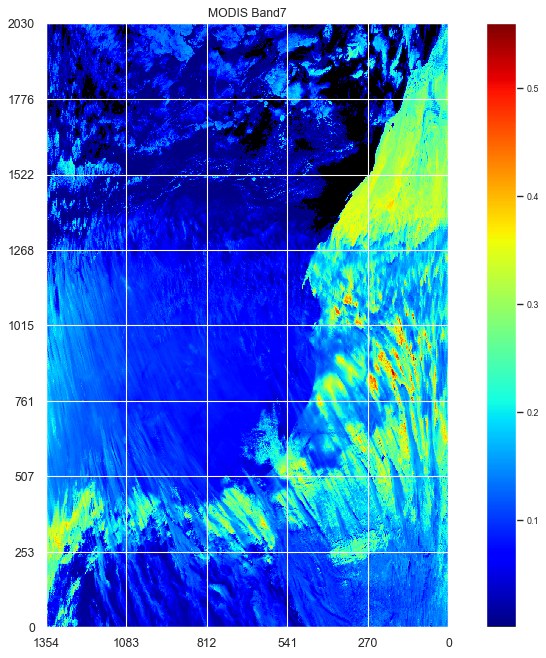

<h1 style='font-size:20px;text-align: center'>
A TensorFlow deep learning algorithm
for MODIS multilayer cloud and thermodynamic phase 
classification using CALIOP and CloudSat
</h1>

<p style='text-align: center'>
Author: Benjamin Marchant 
<br>(marchant.benjamin01@gmail.com)
<br>(benjamin.marchant@nasa.gov)
<br> v1.0.0
</p>

This Jupyter notebook presents a TensorFlow machine learning algorithm to detect cloud thermodynamic phase and multilayer clouds for the MODIS (Moderate Resolution Imaging Spectroradiometer) instrument. The algorithm is trained using a co-located dataset between MODIS CALIOP and CloudSat.

Note 1: dataset used to train the algorithm is publicly available [on Github](https://github.com/benjamin-hg-marchant/ml-gp-modis-multilayer-clouds/tree/master/data).

Note 2: Main author open notebook can be found at the following <a href="https://moonbooks.org/Notebooks/6364d3f0f495b6ab9dcf8d3b5c6e0b01/">url</a>.


Table of Content:

* [Read MODIS CALIOP CLoudSat Co-located Dataset](#dataset)
* [Create cloud phase & multilayer cloud labels](#labels) 
* [Create a simple model that use only 2 modis bands](#simple_case) 
* [How to select features that will be used to train DL models ? ](#select_input_features) 
* [How to split the dataset into a training and testing dataset ?](#split_train_and_test_datasets) 
* [How to prepare the data ? ](#data_preparation) 
* [How to build a model ?](#build_model) 
* [How to create a model to detect monolayer liquid cloud ? ](#monolayer_liquid) 
* [How to create a model to detect monolayer ice cloud ?](#monolayer_ice) 
* [How to create a model to detect monolayer mixed cloud ?](#monolayer_mixed) 
* [How to create a model to detect multilayer ice over liquid cloud ?](#multilayer_ice_over_liquid) 
* [How to create a model to detect multilayer ice over mixed cloud ?](#multilayer_ice_over_mixed) 
* [How to create a model to detect multilayer ice over ice cloud ?](#multilayer_ice_over_ice) 
* [How to create a model to detect multilayer liquid over liquid cloud ?](#multilayer_liquid_over_liquid) 
* [How to apply a machine learning model to a single MODIS granule ?](#modis_granule) 


```python
import tensorflow as tf
import tensorflow_docs as tfdocs
import tensorflow_docs.plots
import tensorflow_docs.modeling
import matplotlib.pyplot as plt
import matplotlib as mpl
import matplotlib.cm as cm
import pandas as pd
import numpy as np
import numpy.ma as ma
import seaborn as sns; sns.set()
import os
import warnings

from tensorflow import keras
from tensorflow.keras import layers
from matplotlib.pyplot import figure
from IPython.core.display import HTML
from pyhdf.SD import SD, SDC 

warnings.filterwarnings('ignore')
```


```python
from IPython.core.display import HTML
HTML("""
<style>
.output_png {
    display: table-cell;
    text-align: center;
    vertical-align: middle;
}
</style>
""")
```


<style>
.output_png {
    display: table-cell;
    text-align: center;
    vertical-align: middle;
}
</style>


```python
os.environ['KMP_DUPLICATE_LIB_OK']='True'
```

### Read MODIS CALIOP CLoudSat Co-located Dataset <a class="anchor" id="dataset"></a>

To train the algorithm, a co-located MODIS CALIOP and CloudSat Dataset has been created using random sampling of pixels selected during the month of January 2008 (5.000 pixels selected randomly each day -> dataset size 31*5000=155000):


```python
df = pd.read_csv('../data/2008_01_colocated_modis_caliop_cloudsat_random_sample_dataset.csv',index_col=False)

print('dataframe shape',df.shape)
```

    dataframe shape (155000, 113)


The file includes the following information:


```python
column_names_list = df.columns

for name in column_names_list:
    print(name)
```

    modis_multilayer_cloud
    modis_multilayer_cloud_qa1
    modis_multilayer_cloud_qa2
    modis_multilayer_cloud_qa3
    modis_multilayer_cloud_qa4
    modis_multilayer_cloud_qa5
    modis_cloud_phase
    latitude
    longitude
    modis_cloud_top_height_1km
    modis_cloud_effective_radius
    modis_cloud_effective_radius_16
    modis_cloud_effective_radius_37
    modis_cloud_optical_thickness
    surface_flag
    nb_tot_cloud_layers
    caliop_1km_nb_cloud_layers
    caliop_5km_nb_cloud_layers
    cldclass_lidar_nb_cloud_layers
    modis_band_1
    modis_band_2
    modis_band_3
    modis_band_4
    modis_band_5
    modis_band_6
    modis_band_7
    modis_band_8
    modis_band_9
    modis_band_10
    modis_band_11
    modis_band_12
    modis_band_13l
    modis_band_13h
    modis_band_14l
    modis_band_14h
    modis_band_15
    modis_band_16
    modis_band_17
    modis_band_18
    modis_band_19
    modis_band_26
    modis_band_20
    modis_band_21
    modis_band_22
    modis_band_23
    modis_band_24
    modis_band_25
    modis_band_27
    modis_band_28
    modis_band_29
    modis_band_30
    modis_band_31
    modis_band_32
    modis_band_33
    modis_band_34
    modis_band_35
    modis_band_36
    modis_band_1_atm_corr_refl
    modis_band_2_atm_corr_refl
    modis_band_5_atm_corr_refl
    modis_band_6_atm_corr_refl
    modis_band_7_atm_corr_refl
    modis_band_20_atm_corr_refl
    cloud_layer_top_01
    cloud_layer_base_01
    cloud_layer_optical_depth_01
    cloud_layer_phase_01
    cloud_layer_source_01
    cloud_layer_top_02
    cloud_layer_base_02
    cloud_layer_optical_depth_02
    cloud_layer_phase_02
    cloud_layer_source_02
    cloud_layer_top_03
    cloud_layer_base_03
    cloud_layer_optical_depth_03
    cloud_layer_phase_03
    cloud_layer_source_03
    cloud_layer_top_04
    cloud_layer_base_04
    cloud_layer_optical_depth_04
    cloud_layer_phase_04
    cloud_layer_source_04
    cloud_layer_top_05
    cloud_layer_base_05
    cloud_layer_optical_depth_05
    cloud_layer_phase_05
    cloud_layer_source_05
    cloud_layer_top_06
    cloud_layer_base_06
    cloud_layer_optical_depth_06
    cloud_layer_phase_06
    cloud_layer_source_06
    cloud_layer_top_07
    cloud_layer_base_07
    cloud_layer_optical_depth_07
    cloud_layer_phase_07
    cloud_layer_source_07
    cloud_layer_top_08
    cloud_layer_base_08
    cloud_layer_optical_depth_08
    cloud_layer_phase_08
    cloud_layer_source_08
    cloud_layer_top_09
    cloud_layer_base_09
    cloud_layer_optical_depth_09
    cloud_layer_phase_09
    cloud_layer_source_09
    cloud_layer_top_10
    cloud_layer_base_10
    cloud_layer_optical_depth_10
    cloud_layer_phase_10
    cloud_layer_source_10


```python
df.head(10)
```


<div>
<style scoped>
    .dataframe tbody tr th:only-of-type {
        vertical-align: middle;
    }

    .dataframe tbody tr th {
        vertical-align: top;
    }

    .dataframe thead th {
        text-align: right;
    }
</style>
<table border="1" class="dataframe">
  <thead>
    <tr style="text-align: right;">
      <th></th>
      <th>modis_multilayer_cloud</th>
      <th>modis_multilayer_cloud_qa1</th>
      <th>modis_multilayer_cloud_qa2</th>
      <th>modis_multilayer_cloud_qa3</th>
      <th>modis_multilayer_cloud_qa4</th>
      <th>modis_multilayer_cloud_qa5</th>
      <th>modis_cloud_phase</th>
      <th>latitude</th>
      <th>longitude</th>
      <th>modis_cloud_top_height_1km</th>
      <th>...</th>
      <th>cloud_layer_top_09</th>
      <th>cloud_layer_base_09</th>
      <th>cloud_layer_optical_depth_09</th>
      <th>cloud_layer_phase_09</th>
      <th>cloud_layer_source_09</th>
      <th>cloud_layer_top_10</th>
      <th>cloud_layer_base_10</th>
      <th>cloud_layer_optical_depth_10</th>
      <th>cloud_layer_phase_10</th>
      <th>cloud_layer_source_10</th>
    </tr>
  </thead>
  <tbody>
    <tr>
      <th>0</th>
      <td>5.0</td>
      <td>1.0</td>
      <td>0.0</td>
      <td>0.0</td>
      <td>0.0</td>
      <td>1.0</td>
      <td>2.0</td>
      <td>-49.767658</td>
      <td>-144.492096</td>
      <td>2700.0</td>
      <td>...</td>
      <td>0.000000</td>
      <td>0.000000</td>
      <td>-9999.0</td>
      <td>0.0</td>
      <td>0.0</td>
      <td>0.0</td>
      <td>0.0</td>
      <td>-9999.0</td>
      <td>0.0</td>
      <td>0.0</td>
    </tr>
    <tr>
      <th>1</th>
      <td>1.0</td>
      <td>0.0</td>
      <td>0.0</td>
      <td>0.0</td>
      <td>0.0</td>
      <td>0.0</td>
      <td>2.0</td>
      <td>7.892334</td>
      <td>87.800476</td>
      <td>4750.0</td>
      <td>...</td>
      <td>2.049999</td>
      <td>1.449999</td>
      <td>0.0</td>
      <td>3.0</td>
      <td>3.0</td>
      <td>0.0</td>
      <td>0.0</td>
      <td>-9999.0</td>
      <td>0.0</td>
      <td>0.0</td>
    </tr>
    <tr>
      <th>2</th>
      <td>1.0</td>
      <td>0.0</td>
      <td>0.0</td>
      <td>0.0</td>
      <td>0.0</td>
      <td>0.0</td>
      <td>2.0</td>
      <td>-52.644794</td>
      <td>29.831434</td>
      <td>500.0</td>
      <td>...</td>
      <td>0.000000</td>
      <td>0.000000</td>
      <td>-9999.0</td>
      <td>0.0</td>
      <td>0.0</td>
      <td>0.0</td>
      <td>0.0</td>
      <td>-9999.0</td>
      <td>0.0</td>
      <td>0.0</td>
    </tr>
    <tr>
      <th>3</th>
      <td>1.0</td>
      <td>0.0</td>
      <td>0.0</td>
      <td>0.0</td>
      <td>0.0</td>
      <td>0.0</td>
      <td>2.0</td>
      <td>28.681301</td>
      <td>-40.599194</td>
      <td>50.0</td>
      <td>...</td>
      <td>0.000000</td>
      <td>0.000000</td>
      <td>-9999.0</td>
      <td>0.0</td>
      <td>0.0</td>
      <td>0.0</td>
      <td>0.0</td>
      <td>-9999.0</td>
      <td>0.0</td>
      <td>0.0</td>
    </tr>
    <tr>
      <th>4</th>
      <td>1.0</td>
      <td>0.0</td>
      <td>0.0</td>
      <td>0.0</td>
      <td>0.0</td>
      <td>0.0</td>
      <td>2.0</td>
      <td>-67.958023</td>
      <td>-82.737038</td>
      <td>1250.0</td>
      <td>...</td>
      <td>0.000000</td>
      <td>0.000000</td>
      <td>-9999.0</td>
      <td>0.0</td>
      <td>0.0</td>
      <td>0.0</td>
      <td>0.0</td>
      <td>-9999.0</td>
      <td>0.0</td>
      <td>0.0</td>
    </tr>
    <tr>
      <th>5</th>
      <td>1.0</td>
      <td>0.0</td>
      <td>0.0</td>
      <td>0.0</td>
      <td>0.0</td>
      <td>0.0</td>
      <td>2.0</td>
      <td>-60.335007</td>
      <td>-138.910355</td>
      <td>850.0</td>
      <td>...</td>
      <td>0.000000</td>
      <td>0.000000</td>
      <td>-9999.0</td>
      <td>0.0</td>
      <td>0.0</td>
      <td>0.0</td>
      <td>0.0</td>
      <td>-9999.0</td>
      <td>0.0</td>
      <td>0.0</td>
    </tr>
    <tr>
      <th>6</th>
      <td>8.0</td>
      <td>0.0</td>
      <td>1.0</td>
      <td>1.0</td>
      <td>0.0</td>
      <td>1.0</td>
      <td>3.0</td>
      <td>-63.907398</td>
      <td>36.836395</td>
      <td>7450.0</td>
      <td>...</td>
      <td>0.000000</td>
      <td>0.000000</td>
      <td>-9999.0</td>
      <td>0.0</td>
      <td>0.0</td>
      <td>0.0</td>
      <td>0.0</td>
      <td>-9999.0</td>
      <td>0.0</td>
      <td>0.0</td>
    </tr>
    <tr>
      <th>7</th>
      <td>1.0</td>
      <td>0.0</td>
      <td>0.0</td>
      <td>0.0</td>
      <td>0.0</td>
      <td>0.0</td>
      <td>2.0</td>
      <td>-23.554411</td>
      <td>-4.174837</td>
      <td>0.0</td>
      <td>...</td>
      <td>0.000000</td>
      <td>0.000000</td>
      <td>-9999.0</td>
      <td>0.0</td>
      <td>0.0</td>
      <td>0.0</td>
      <td>0.0</td>
      <td>-9999.0</td>
      <td>0.0</td>
      <td>0.0</td>
    </tr>
    <tr>
      <th>8</th>
      <td>1.0</td>
      <td>0.0</td>
      <td>0.0</td>
      <td>0.0</td>
      <td>0.0</td>
      <td>0.0</td>
      <td>2.0</td>
      <td>-16.378271</td>
      <td>-30.564116</td>
      <td>2800.0</td>
      <td>...</td>
      <td>0.000000</td>
      <td>0.000000</td>
      <td>-9999.0</td>
      <td>0.0</td>
      <td>0.0</td>
      <td>0.0</td>
      <td>0.0</td>
      <td>-9999.0</td>
      <td>0.0</td>
      <td>0.0</td>
    </tr>
    <tr>
      <th>9</th>
      <td>0.0</td>
      <td>0.0</td>
      <td>0.0</td>
      <td>0.0</td>
      <td>0.0</td>
      <td>0.0</td>
      <td>4.0</td>
      <td>-6.938173</td>
      <td>115.692223</td>
      <td>7150.0</td>
      <td>...</td>
      <td>0.000000</td>
      <td>0.000000</td>
      <td>-9999.0</td>
      <td>0.0</td>
      <td>0.0</td>
      <td>0.0</td>
      <td>0.0</td>
      <td>-9999.0</td>
      <td>0.0</td>
      <td>0.0</td>
    </tr>
  </tbody>
</table>
<p>10 rows × 113 columns</p>
</div>


Remove rows with no data or clear pixels:


```python
df = df[df.modis_multilayer_cloud != 0]

print('dataframe shape',df.shape)
```

    dataframe shape (111558, 113)


```python
df['latitude'].plot(kind='hist',bins=50)

plt.xlabel('latitude')

plt.show()
```


Remove pixels with latitude > 70:


```python
df = df.loc[ abs( df['latitude'] ) < 70]

print('dataframe shape',df.shape)
```

    dataframe shape (101483, 113)


```python
df = df.sample(n=10000, random_state = 42)
```

### Create cloud phase & multilayer cloud labels <a class="anchor" id="labels"></a>

Using the cldclass-lidar product (corresponding to cloud_layer_source = 3) in the dataset, let's define monolayer and multilayer clouds labels that will be used to train the machine learning algorithm:


```python
df['label 1'] = 'unlabeled'
df['label 2'] = 'unlabeled'

#print(df.head())

for index, row in df.iterrows():
    nb_cloud_layer = 0
    cloud_phase_per_layer_list = []
    for layer_idx in range(10):
        if int( row['cloud_layer_source_{:02d}'.format(layer_idx+1)] ) == 3: # cldclass-lidar product
            cloud_phase_per_layer_list.append( int( row['cloud_layer_phase_{:02d}'.format(layer_idx+1)] ) )
            nb_cloud_layer = nb_cloud_layer + 1
    if nb_cloud_layer == 1: # monolayer cloud   
        df.loc[index,'label 1'] = 'monolayer (n=1)'
        if cloud_phase_per_layer_list[0] == 1: df.loc[index,'label 2'] = 'ice'
        if cloud_phase_per_layer_list[0] == 2: df.loc[index,'label 2'] = 'mixed'    
        if cloud_phase_per_layer_list[0] == 3: df.loc[index,'label 2'] = 'liquid'
    if nb_cloud_layer == 2: # multilayer cloud 
        df.loc[index,'label 1'] = 'multilayer (n=2)'
        if cloud_phase_per_layer_list[0] == 1 and cloud_phase_per_layer_list[1] == 1: 
            df.loc[index,'label 2'] = 'ice / ice'
        if cloud_phase_per_layer_list[0] == 1 and cloud_phase_per_layer_list[1] == 3: 
            df.loc[index,'label 2'] = 'ice / liquid'
        if cloud_phase_per_layer_list[0] == 1 and cloud_phase_per_layer_list[1] == 2: 
            df.loc[index,'label 2'] = 'ice / mixed'
        if cloud_phase_per_layer_list[0] == 3 and cloud_phase_per_layer_list[1] == 3: 
            df.loc[index,'label 2'] = 'liquid / liquid'
        if cloud_phase_per_layer_list[0] == 2 and cloud_phase_per_layer_list[1] == 3: 
            df.loc[index,'label 2'] = 'mixed / liquid'    
        if cloud_phase_per_layer_list[0] == 3 and cloud_phase_per_layer_list[1] == 1: 
            df.loc[index,'label 2'] = 'liquid / ice'
    if nb_cloud_layer > 2: # multilayer cloud 
        df.loc[index,'label 1'] = 'multilayer (n>2)'
```


```python
df['label 1'].value_counts()
```


    monolayer (n=1)     5842
    multilayer (n=2)    2661
    multilayer (n>2)    1079
    unlabeled            418
    Name: label 1, dtype: int64


```python
df['label 1'].value_counts().plot(kind='pie', figsize=(8, 8))

plt.show()
```


```python
df['label 1'].value_counts().plot(kind='bar')

plt.show()
```


```python
df['label 2'].value_counts()
```


    liquid             2908
    ice                1624
    unlabeled          1560
    mixed              1310
    ice / liquid       1237
    ice / mixed         479
    ice / ice           452
    liquid / liquid     271
    mixed / liquid      151
    liquid / ice          8
    Name: label 2, dtype: int64


```python
df['label 2'].value_counts().plot(kind='bar')

plt.show()
```


```python
df.drop( df[(df['label 1'] == 'unlabeled' ) | (df['label 2'] == 'unlabeled')].index, inplace=True )

print(df.shape)
```

    (8440, 115)


```python
df['label 2'].value_counts().plot(kind='bar')

plt.savefig('output.png', bbox_inches='tight')
plt.show()
```


### Create a simple model that use only 2 modis bands <a class="anchor" id="simple_case"></a>


```python
sub_dataset = df[ ['modis_band_1','modis_band_7', 'label 2'] ] [ (df['label 2'] == 'liquid') | (df['label 2'] == 'ice') ]

train_dataset = sub_dataset.sample(frac=0.8,random_state=0)

test_dataset = sub_dataset.drop(train_dataset.index)

test_dataset
```


<div>
<style scoped>
    .dataframe tbody tr th:only-of-type {
        vertical-align: middle;
    }

    .dataframe tbody tr th {
        vertical-align: top;
    }

    .dataframe thead th {
        text-align: right;
    }
</style>
<table border="1" class="dataframe">
  <thead>
    <tr style="text-align: right;">
      <th></th>
      <th>modis_band_1</th>
      <th>modis_band_7</th>
      <th>label 2</th>
    </tr>
  </thead>
  <tbody>
    <tr>
      <th>23625</th>
      <td>0.121545</td>
      <td>0.063265</td>
      <td>ice</td>
    </tr>
    <tr>
      <th>54012</th>
      <td>0.196092</td>
      <td>0.074602</td>
      <td>ice</td>
    </tr>
    <tr>
      <th>72033</th>
      <td>0.377801</td>
      <td>0.077946</td>
      <td>ice</td>
    </tr>
    <tr>
      <th>143305</th>
      <td>0.184228</td>
      <td>0.091218</td>
      <td>liquid</td>
    </tr>
    <tr>
      <th>9962</th>
      <td>0.266254</td>
      <td>0.208120</td>
      <td>liquid</td>
    </tr>
    <tr>
      <th>...</th>
      <td>...</td>
      <td>...</td>
      <td>...</td>
    </tr>
    <tr>
      <th>24034</th>
      <td>0.047854</td>
      <td>0.015684</td>
      <td>ice</td>
    </tr>
    <tr>
      <th>44227</th>
      <td>0.291430</td>
      <td>0.159342</td>
      <td>liquid</td>
    </tr>
    <tr>
      <th>82145</th>
      <td>0.182224</td>
      <td>0.062771</td>
      <td>ice</td>
    </tr>
    <tr>
      <th>46418</th>
      <td>0.075745</td>
      <td>0.068562</td>
      <td>liquid</td>
    </tr>
    <tr>
      <th>151393</th>
      <td>0.172504</td>
      <td>0.089052</td>
      <td>ice</td>
    </tr>
  </tbody>
</table>
<p>906 rows × 3 columns</p>
</div>


```python
train_dataset_stats = train_dataset.describe()
train_dataset_stats = train_dataset_stats.transpose()
train_dataset_stats
```


<div>
<style scoped>
    .dataframe tbody tr th:only-of-type {
        vertical-align: middle;
    }

    .dataframe tbody tr th {
        vertical-align: top;
    }

    .dataframe thead th {
        text-align: right;
    }
</style>
<table border="1" class="dataframe">
  <thead>
    <tr style="text-align: right;">
      <th></th>
      <th>count</th>
      <th>mean</th>
      <th>std</th>
      <th>min</th>
      <th>25%</th>
      <th>50%</th>
      <th>75%</th>
      <th>max</th>
    </tr>
  </thead>
  <tbody>
    <tr>
      <th>modis_band_1</th>
      <td>3626.0</td>
      <td>0.243452</td>
      <td>0.164852</td>
      <td>0.015472</td>
      <td>0.106141</td>
      <td>0.209122</td>
      <td>0.347182</td>
      <td>0.983303</td>
    </tr>
    <tr>
      <th>modis_band_7</th>
      <td>3626.0</td>
      <td>0.118082</td>
      <td>0.076499</td>
      <td>0.007092</td>
      <td>0.052689</td>
      <td>0.100444</td>
      <td>0.175433</td>
      <td>0.465181</td>
    </tr>
  </tbody>
</table>
</div>


```python
train_dataset_labels = train_dataset.pop('label 2')
test_dataset_labels = test_dataset.pop('label 2')
```


```python
train_dataset_labels[ train_dataset_labels == 'liquid'] = 0.0
train_dataset_labels[ train_dataset_labels == 'ice'] = 1.0

train_dataset_labels
```


    107288    0
    10352     1
    112725    1
    43185     1
    56602     0
             ..
    84542     1
    109995    0
    65572     1
    16303     0
    10812     0
    Name: label 2, Length: 3626, dtype: object


```python
test_dataset_labels[ test_dataset_labels == 'liquid'] = 0.0
test_dataset_labels[ test_dataset_labels == 'ice'] = 1.0

test_dataset_labels
```


    23625     1
    54012     1
    72033     1
    143305    0
    9962      0
             ..
    24034     1
    44227     0
    82145     1
    46418     0
    151393    1
    Name: label 2, Length: 906, dtype: object


```python
def norm(x):
  return (x - train_dataset_stats['mean']) / train_dataset_stats['std']

normed_train_dataset = norm(train_dataset)
normed_test_dataset = norm(test_dataset)

normed_train_dataset_stats = normed_train_dataset.describe()
normed_train_dataset_stats = normed_train_dataset_stats.transpose()
normed_train_dataset_stats
```


<div>
<style scoped>
    .dataframe tbody tr th:only-of-type {
        vertical-align: middle;
    }

    .dataframe tbody tr th {
        vertical-align: top;
    }

    .dataframe thead th {
        text-align: right;
    }
</style>
<table border="1" class="dataframe">
  <thead>
    <tr style="text-align: right;">
      <th></th>
      <th>count</th>
      <th>mean</th>
      <th>std</th>
      <th>min</th>
      <th>25%</th>
      <th>50%</th>
      <th>75%</th>
      <th>max</th>
    </tr>
  </thead>
  <tbody>
    <tr>
      <th>modis_band_1</th>
      <td>3626.0</td>
      <td>-3.919155e-18</td>
      <td>1.0</td>
      <td>-1.382936</td>
      <td>-0.832934</td>
      <td>-0.208246</td>
      <td>0.629230</td>
      <td>4.487962</td>
    </tr>
    <tr>
      <th>modis_band_7</th>
      <td>3626.0</td>
      <td>9.797887e-18</td>
      <td>1.0</td>
      <td>-1.450879</td>
      <td>-0.854826</td>
      <td>-0.230567</td>
      <td>0.749693</td>
      <td>4.537309</td>
    </tr>
  </tbody>
</table>
</div>


```python
print(train_dataset.shape)
print(type(train_dataset))
```

    (3626, 2)
    <class 'pandas.core.frame.DataFrame'>


```python
print(normed_train_dataset.shape)
```

    (3626, 2)


```python
df_monolayer_liquid = df.loc[df['label 2'] == 'liquid']
df_monolayer_ice = df.loc[df['label 2'] == 'ice']

fig = figure(num=None, figsize=(12, 10), dpi=80, facecolor='w', edgecolor='k')

plt.scatter(df_monolayer_liquid['modis_band_1'], df_monolayer_liquid['modis_band_7'], s=10, c='steelblue', marker = 'x', label="CloudSat-Caliop: Liquid cloud phase")
plt.scatter(df_monolayer_ice['modis_band_1'], df_monolayer_ice['modis_band_7'], s=10, c='coral', marker = 'o', label="CloudSat-Caliop: Ice cloud phase")

plt.show()
plt.close()
```


```python
def build_model():
    model = keras.Sequential([
    layers.Dense(4, activation='relu', input_shape=[len(train_dataset.keys())]),
    layers.Dense(4, activation='relu'),
    layers.Dense(1, activation='sigmoid')
    ])

    model.compile(optimizer='adam', loss='binary_crossentropy', metrics=['accuracy'])

    return model
```


```python
model = build_model()
```


```python
model.summary()
```

    Model: "sequential_19"
    _________________________________________________________________
    Layer (type)                 Output Shape              Param #   
    =================================================================
    dense_57 (Dense)             (None, 4)                 12        
    _________________________________________________________________
    dense_58 (Dense)             (None, 4)                 20        
    _________________________________________________________________
    dense_59 (Dense)             (None, 1)                 5         
    =================================================================
    Total params: 37
    Trainable params: 37
    Non-trainable params: 0
    _________________________________________________________________


```python
model.fit(normed_train_dataset, train_dataset_labels, epochs=400, batch_size=400, verbose=0, callbacks=[tfdocs.modeling.EpochDots()])
```

    WARNING:tensorflow:Falling back from v2 loop because of error: Failed to find data adapter that can handle input: <class 'pandas.core.frame.DataFrame'>, <class 'NoneType'>
    
    Epoch: 0, accuracy:0.6412,  loss:0.6841,  
    ....................................................................................................
    Epoch: 100, accuracy:0.8434,  loss:0.4585,  
    ....................................................................................................
    Epoch: 200, accuracy:0.8434,  loss:0.4312,  
    ....................................................................................................
    Epoch: 300, accuracy:0.8442,  loss:0.4225,  
    ....................................................................................................


    <tensorflow.python.keras.callbacks.History at 0x1a47055e90>


```python
print(train_dataset.shape)

train_dataset
```

    (3626, 2)


<div>
<style scoped>
    .dataframe tbody tr th:only-of-type {
        vertical-align: middle;
    }

    .dataframe tbody tr th {
        vertical-align: top;
    }

    .dataframe thead th {
        text-align: right;
    }
</style>
<table border="1" class="dataframe">
  <thead>
    <tr style="text-align: right;">
      <th></th>
      <th>modis_band_1</th>
      <th>modis_band_7</th>
    </tr>
  </thead>
  <tbody>
    <tr>
      <th>107288</th>
      <td>0.080915</td>
      <td>0.037416</td>
    </tr>
    <tr>
      <th>10352</th>
      <td>0.179174</td>
      <td>0.048637</td>
    </tr>
    <tr>
      <th>112725</th>
      <td>0.174535</td>
      <td>0.029450</td>
    </tr>
    <tr>
      <th>43185</th>
      <td>0.064298</td>
      <td>0.030232</td>
    </tr>
    <tr>
      <th>56602</th>
      <td>0.136541</td>
      <td>0.090690</td>
    </tr>
    <tr>
      <th>...</th>
      <td>...</td>
      <td>...</td>
    </tr>
    <tr>
      <th>84542</th>
      <td>0.050598</td>
      <td>0.019513</td>
    </tr>
    <tr>
      <th>109995</th>
      <td>0.119979</td>
      <td>0.159746</td>
    </tr>
    <tr>
      <th>65572</th>
      <td>0.234993</td>
      <td>0.054175</td>
    </tr>
    <tr>
      <th>16303</th>
      <td>0.158686</td>
      <td>0.137400</td>
    </tr>
    <tr>
      <th>10812</th>
      <td>0.476642</td>
      <td>0.244656</td>
    </tr>
  </tbody>
</table>
<p>3626 rows × 2 columns</p>
</div>


```python
x1, x2 = np.meshgrid(np.arange(0.0,1.0, 0.001), np.arange(0.0,0.5, 0.001))

print(x1.shape)

print(x1.flatten())
print(x2.flatten())

gridded_test = np.stack((x1.flatten(),x2.flatten()),axis=-1)

print(gridded_test)

print(gridded_test.shape)
```

    (500, 1000)
    [0.    0.001 0.002 ... 0.997 0.998 0.999]
    [0.    0.    0.    ... 0.499 0.499 0.499]
    [[0.    0.   ]
     [0.001 0.   ]
     [0.002 0.   ]
     ...
     [0.997 0.499]
     [0.998 0.499]
     [0.999 0.499]]
    (500000, 2)


```python
gridded_test = pd.DataFrame(data=gridded_test, columns=['modis_band_1','modis_band_7'])

normed_gridded_test = norm(gridded_test)

normed_gridded_test
```


<div>
<style scoped>
    .dataframe tbody tr th:only-of-type {
        vertical-align: middle;
    }

    .dataframe tbody tr th {
        vertical-align: top;
    }

    .dataframe thead th {
        text-align: right;
    }
</style>
<table border="1" class="dataframe">
  <thead>
    <tr style="text-align: right;">
      <th></th>
      <th>modis_band_1</th>
      <th>modis_band_7</th>
    </tr>
  </thead>
  <tbody>
    <tr>
      <th>0</th>
      <td>-1.476788</td>
      <td>-1.543580</td>
    </tr>
    <tr>
      <th>1</th>
      <td>-1.470722</td>
      <td>-1.543580</td>
    </tr>
    <tr>
      <th>2</th>
      <td>-1.464656</td>
      <td>-1.543580</td>
    </tr>
    <tr>
      <th>3</th>
      <td>-1.458590</td>
      <td>-1.543580</td>
    </tr>
    <tr>
      <th>4</th>
      <td>-1.452524</td>
      <td>-1.543580</td>
    </tr>
    <tr>
      <th>...</th>
      <td>...</td>
      <td>...</td>
    </tr>
    <tr>
      <th>499995</th>
      <td>4.558915</td>
      <td>4.979389</td>
    </tr>
    <tr>
      <th>499996</th>
      <td>4.564981</td>
      <td>4.979389</td>
    </tr>
    <tr>
      <th>499997</th>
      <td>4.571047</td>
      <td>4.979389</td>
    </tr>
    <tr>
      <th>499998</th>
      <td>4.577113</td>
      <td>4.979389</td>
    </tr>
    <tr>
      <th>499999</th>
      <td>4.583179</td>
      <td>4.979389</td>
    </tr>
  </tbody>
</table>
<p>500000 rows × 2 columns</p>
</div>


```python
yhat = model.predict(normed_gridded_test)
```

    WARNING:tensorflow:Falling back from v2 loop because of error: Failed to find data adapter that can handle input: <class 'pandas.core.frame.DataFrame'>, <class 'NoneType'>


```python
yhat
```


    array([[5.1313084e-01],
           [5.2201575e-01],
           [5.3088641e-01],
           ...,
           [8.4280968e-05],
           [8.3029270e-05],
           [8.1717968e-05]], dtype=float32)


```python
from pylab import figure, cm

fig = figure(num=None, figsize=(12, 10), dpi=80, facecolor='w', edgecolor='k')

ax = fig.add_subplot(111)

def forceAspect(ax,aspect):
    im = ax.get_images()
    extent =  im[0].get_extent()
    ax.set_aspect(abs((extent[1]-extent[0])/(extent[3]-extent[2]))/aspect)

img = plt.imshow(yhat.reshape(500,1000), cmap=cm.jet, origin='lower',extent=[0.0,1.0,0.0,0.5],vmin=0.0,vmax=1.0)

plt.scatter(df_monolayer_liquid['modis_band_1'], df_monolayer_liquid['modis_band_7'], s=1, c='steelblue', marker = 'x', label="CloudSat-Caliop: Liquid cloud phase")
plt.scatter(df_monolayer_ice['modis_band_1'], df_monolayer_ice['modis_band_7'], s=1, c='coral', marker = 'o', label="CloudSat-Caliop: Ice cloud phase")

plt.colorbar(img)

plt.xlabel('MODIS Band 1',fontsize=11)
plt.ylabel('MODIS Band 7',fontsize=11)

forceAspect(ax,aspect=1.0)

plt.show()
```


### How to select features that will be used to train DL models ?  <a class="anchor" id="select_input_features"></a>


```python
features_list = ['modis_band_1','modis_band_7','modis_band_20',
                 'modis_band_26','modis_band_28','modis_band_29',
                 'modis_band_31','modis_band_32']

sub_dataset = df[features_list + ['label 2']]
```

### How to split the dataset into a training and testing dataset ?  <a class="anchor" id="split_train_and_test_datasets"></a>


```python
train_dataset = sub_dataset.sample(frac=0.8,random_state=0)

test_dataset = sub_dataset.drop(train_dataset.index)

test_dataset
```


<div>
<style scoped>
    .dataframe tbody tr th:only-of-type {
        vertical-align: middle;
    }

    .dataframe tbody tr th {
        vertical-align: top;
    }

    .dataframe thead th {
        text-align: right;
    }
</style>
<table border="1" class="dataframe">
  <thead>
    <tr style="text-align: right;">
      <th></th>
      <th>modis_band_1</th>
      <th>modis_band_7</th>
      <th>modis_band_20</th>
      <th>modis_band_26</th>
      <th>modis_band_28</th>
      <th>modis_band_29</th>
      <th>modis_band_31</th>
      <th>modis_band_32</th>
      <th>label 2</th>
    </tr>
  </thead>
  <tbody>
    <tr>
      <th>23625</th>
      <td>0.121545</td>
      <td>0.063265</td>
      <td>0.168468</td>
      <td>0.062168</td>
      <td>1.538927</td>
      <td>3.594860</td>
      <td>4.173019</td>
      <td>4.014662</td>
      <td>ice</td>
    </tr>
    <tr>
      <th>74403</th>
      <td>0.072404</td>
      <td>0.073994</td>
      <td>0.584660</td>
      <td>0.001681</td>
      <td>3.039265</td>
      <td>6.917314</td>
      <td>7.601471</td>
      <td>7.099782</td>
      <td>liquid</td>
    </tr>
    <tr>
      <th>45369</th>
      <td>0.174023</td>
      <td>0.043167</td>
      <td>0.251291</td>
      <td>0.085529</td>
      <td>1.495625</td>
      <td>4.091222</td>
      <td>4.867431</td>
      <td>4.384099</td>
      <td>ice / ice</td>
    </tr>
    <tr>
      <th>30688</th>
      <td>0.116897</td>
      <td>0.038544</td>
      <td>0.091121</td>
      <td>0.005178</td>
      <td>1.706935</td>
      <td>3.041675</td>
      <td>3.964110</td>
      <td>3.965555</td>
      <td>mixed</td>
    </tr>
    <tr>
      <th>22397</th>
      <td>0.149856</td>
      <td>0.155394</td>
      <td>0.691948</td>
      <td>0.007789</td>
      <td>2.362034</td>
      <td>5.351905</td>
      <td>6.115028</td>
      <td>5.705967</td>
      <td>liquid</td>
    </tr>
    <tr>
      <th>...</th>
      <td>...</td>
      <td>...</td>
      <td>...</td>
      <td>...</td>
      <td>...</td>
      <td>...</td>
      <td>...</td>
      <td>...</td>
      <td>...</td>
    </tr>
    <tr>
      <th>132291</th>
      <td>0.465708</td>
      <td>0.127007</td>
      <td>0.202568</td>
      <td>0.022899</td>
      <td>2.052767</td>
      <td>3.877302</td>
      <td>4.658522</td>
      <td>4.578811</td>
      <td>ice / mixed</td>
    </tr>
    <tr>
      <th>113429</th>
      <td>0.758348</td>
      <td>0.186967</td>
      <td>0.442857</td>
      <td>0.008670</td>
      <td>3.042536</td>
      <td>6.245470</td>
      <td>6.887536</td>
      <td>6.560185</td>
      <td>ice / liquid</td>
    </tr>
    <tr>
      <th>57898</th>
      <td>0.368833</td>
      <td>0.171305</td>
      <td>0.507798</td>
      <td>0.000187</td>
      <td>3.128369</td>
      <td>6.380841</td>
      <td>7.097747</td>
      <td>6.757181</td>
      <td>liquid / liquid</td>
    </tr>
    <tr>
      <th>108937</th>
      <td>0.273708</td>
      <td>0.152058</td>
      <td>0.237637</td>
      <td>0.005958</td>
      <td>2.159577</td>
      <td>4.380350</td>
      <td>5.293059</td>
      <td>5.186357</td>
      <td>mixed</td>
    </tr>
    <tr>
      <th>126214</th>
      <td>0.302477</td>
      <td>0.210020</td>
      <td>0.387411</td>
      <td>0.039310</td>
      <td>2.025440</td>
      <td>3.504055</td>
      <td>4.387786</td>
      <td>4.293881</td>
      <td>liquid</td>
    </tr>
  </tbody>
</table>
<p>1688 rows × 9 columns</p>
</div>


### How to prepare the data ?  <a class="anchor" id="data_preparation"></a>


```python
label_name = 'liquid'

train_dataset_prepared = train_dataset.copy()

test_dataset_prepared = test_dataset.copy()

train_dataset_prepared['label 2'][ train_dataset_prepared['label 2'] != label_name ] = '(not) ' + label_name

train_dataset_prepared['label 2'].value_counts().plot(kind='bar')

plt.show() 
```


```python
t1 = train_dataset_prepared[ train_dataset_prepared['label 2'] == label_name  ]
t2 = train_dataset_prepared[ train_dataset_prepared['label 2'] != label_name  ]

ids = np.arange(len(t1))
choices = np.random.choice(ids, len(t2))

print(choices.shape)

t1 = t1.iloc[choices,:]

print( t1.shape )

t1
```

    (4470,)
    (4470, 9)


<div>
<style scoped>
    .dataframe tbody tr th:only-of-type {
        vertical-align: middle;
    }

    .dataframe tbody tr th {
        vertical-align: top;
    }

    .dataframe thead th {
        text-align: right;
    }
</style>
<table border="1" class="dataframe">
  <thead>
    <tr style="text-align: right;">
      <th></th>
      <th>modis_band_1</th>
      <th>modis_band_7</th>
      <th>modis_band_20</th>
      <th>modis_band_26</th>
      <th>modis_band_28</th>
      <th>modis_band_29</th>
      <th>modis_band_31</th>
      <th>modis_band_32</th>
      <th>label 2</th>
    </tr>
  </thead>
  <tbody>
    <tr>
      <th>113310</th>
      <td>0.110495</td>
      <td>0.131768</td>
      <td>0.456510</td>
      <td>0.009581</td>
      <td>2.098570</td>
      <td>4.083423</td>
      <td>4.896066</td>
      <td>4.629630</td>
      <td>liquid</td>
    </tr>
    <tr>
      <th>126578</th>
      <td>0.192958</td>
      <td>0.107965</td>
      <td>0.225647</td>
      <td>0.001497</td>
      <td>2.431316</td>
      <td>4.470040</td>
      <td>5.388076</td>
      <td>5.277146</td>
      <td>liquid</td>
    </tr>
    <tr>
      <th>113075</th>
      <td>0.311978</td>
      <td>0.219205</td>
      <td>0.721612</td>
      <td>0.011825</td>
      <td>3.024061</td>
      <td>6.068874</td>
      <td>6.827662</td>
      <td>6.466541</td>
      <td>liquid</td>
    </tr>
    <tr>
      <th>37292</th>
      <td>0.051924</td>
      <td>0.038213</td>
      <td>0.365440</td>
      <td>0.001330</td>
      <td>3.067747</td>
      <td>6.596990</td>
      <td>7.244829</td>
      <td>6.748616</td>
      <td>liquid</td>
    </tr>
    <tr>
      <th>70342</th>
      <td>0.111546</td>
      <td>0.028357</td>
      <td>0.123003</td>
      <td>0.001681</td>
      <td>2.065661</td>
      <td>3.457260</td>
      <td>4.361103</td>
      <td>4.329283</td>
      <td>liquid</td>
    </tr>
    <tr>
      <th>...</th>
      <td>...</td>
      <td>...</td>
      <td>...</td>
      <td>...</td>
      <td>...</td>
      <td>...</td>
      <td>...</td>
      <td>...</td>
      <td>...</td>
    </tr>
    <tr>
      <th>61867</th>
      <td>0.049450</td>
      <td>0.042426</td>
      <td>0.301955</td>
      <td>0.001797</td>
      <td>2.412648</td>
      <td>6.050490</td>
      <td>6.895997</td>
      <td>6.540201</td>
      <td>liquid</td>
    </tr>
    <tr>
      <th>4673</th>
      <td>0.268956</td>
      <td>0.166799</td>
      <td>0.513135</td>
      <td>0.005947</td>
      <td>2.768103</td>
      <td>5.516803</td>
      <td>6.343461</td>
      <td>6.061131</td>
      <td>liquid</td>
    </tr>
    <tr>
      <th>118078</th>
      <td>0.543695</td>
      <td>0.178123</td>
      <td>0.323024</td>
      <td>0.016082</td>
      <td>2.616838</td>
      <td>4.859443</td>
      <td>5.733655</td>
      <td>5.572924</td>
      <td>liquid</td>
    </tr>
    <tr>
      <th>33760</th>
      <td>0.232294</td>
      <td>0.117332</td>
      <td>0.505372</td>
      <td>0.001960</td>
      <td>2.831611</td>
      <td>6.354101</td>
      <td>7.210987</td>
      <td>6.789157</td>
      <td>liquid</td>
    </tr>
    <tr>
      <th>138518</th>
      <td>0.555431</td>
      <td>0.205246</td>
      <td>0.365024</td>
      <td>0.009404</td>
      <td>2.868754</td>
      <td>5.125729</td>
      <td>5.995279</td>
      <td>5.819026</td>
      <td>liquid</td>
    </tr>
  </tbody>
</table>
<p>4470 rows × 9 columns</p>
</div>


```python
train_dataset_prepared = pd.concat([t1, t2], axis=0)

train_dataset_prepared
```


<div>
<style scoped>
    .dataframe tbody tr th:only-of-type {
        vertical-align: middle;
    }

    .dataframe tbody tr th {
        vertical-align: top;
    }

    .dataframe thead th {
        text-align: right;
    }
</style>
<table border="1" class="dataframe">
  <thead>
    <tr style="text-align: right;">
      <th></th>
      <th>modis_band_1</th>
      <th>modis_band_7</th>
      <th>modis_band_20</th>
      <th>modis_band_26</th>
      <th>modis_band_28</th>
      <th>modis_band_29</th>
      <th>modis_band_31</th>
      <th>modis_band_32</th>
      <th>label 2</th>
    </tr>
  </thead>
  <tbody>
    <tr>
      <th>113310</th>
      <td>0.110495</td>
      <td>0.131768</td>
      <td>0.456510</td>
      <td>0.009581</td>
      <td>2.098570</td>
      <td>4.083423</td>
      <td>4.896066</td>
      <td>4.629630</td>
      <td>liquid</td>
    </tr>
    <tr>
      <th>126578</th>
      <td>0.192958</td>
      <td>0.107965</td>
      <td>0.225647</td>
      <td>0.001497</td>
      <td>2.431316</td>
      <td>4.470040</td>
      <td>5.388076</td>
      <td>5.277146</td>
      <td>liquid</td>
    </tr>
    <tr>
      <th>113075</th>
      <td>0.311978</td>
      <td>0.219205</td>
      <td>0.721612</td>
      <td>0.011825</td>
      <td>3.024061</td>
      <td>6.068874</td>
      <td>6.827662</td>
      <td>6.466541</td>
      <td>liquid</td>
    </tr>
    <tr>
      <th>37292</th>
      <td>0.051924</td>
      <td>0.038213</td>
      <td>0.365440</td>
      <td>0.001330</td>
      <td>3.067747</td>
      <td>6.596990</td>
      <td>7.244829</td>
      <td>6.748616</td>
      <td>liquid</td>
    </tr>
    <tr>
      <th>70342</th>
      <td>0.111546</td>
      <td>0.028357</td>
      <td>0.123003</td>
      <td>0.001681</td>
      <td>2.065661</td>
      <td>3.457260</td>
      <td>4.361103</td>
      <td>4.329283</td>
      <td>liquid</td>
    </tr>
    <tr>
      <th>...</th>
      <td>...</td>
      <td>...</td>
      <td>...</td>
      <td>...</td>
      <td>...</td>
      <td>...</td>
      <td>...</td>
      <td>...</td>
      <td>...</td>
    </tr>
    <tr>
      <th>42004</th>
      <td>0.096525</td>
      <td>0.069227</td>
      <td>0.435233</td>
      <td>0.001563</td>
      <td>3.112396</td>
      <td>6.386412</td>
      <td>7.147859</td>
      <td>6.767459</td>
      <td>(not) liquid</td>
    </tr>
    <tr>
      <th>86891</th>
      <td>0.202347</td>
      <td>0.150409</td>
      <td>0.281232</td>
      <td>0.002405</td>
      <td>2.207497</td>
      <td>4.709587</td>
      <td>5.621716</td>
      <td>5.464434</td>
      <td>(not) liquid</td>
    </tr>
    <tr>
      <th>132832</th>
      <td>0.067075</td>
      <td>0.027187</td>
      <td>0.170201</td>
      <td>0.024672</td>
      <td>1.889955</td>
      <td>4.387034</td>
      <td>5.073086</td>
      <td>4.879158</td>
      <td>(not) liquid</td>
    </tr>
    <tr>
      <th>82796</th>
      <td>0.099081</td>
      <td>0.024329</td>
      <td>0.059309</td>
      <td>0.023904</td>
      <td>1.514485</td>
      <td>2.639459</td>
      <td>3.424591</td>
      <td>3.428243</td>
      <td>(not) liquid</td>
    </tr>
    <tr>
      <th>19236</th>
      <td>0.296014</td>
      <td>0.111344</td>
      <td>0.212271</td>
      <td>0.138441</td>
      <td>1.166729</td>
      <td>2.818284</td>
      <td>3.205920</td>
      <td>3.053096</td>
      <td>(not) liquid</td>
    </tr>
  </tbody>
</table>
<p>8940 rows × 9 columns</p>
</div>


```python
train_dataset_prepared['label 2'].value_counts().plot(kind='bar')

plt.show() 
```


```python
train_dataset_prepared_labels = train_dataset_prepared.pop('label 2')
test_dataset_prepared_labels = test_dataset_prepared.pop('label 2')
```


```python
train_dataset_prepared_labels[ train_dataset_prepared_labels != label_name] = 0.0
train_dataset_prepared_labels[ train_dataset_prepared_labels == label_name] = 1.0

train_dataset_prepared_labels
```


    113310    1
    126578    1
    113075    1
    37292     1
    70342     1
             ..
    42004     0
    86891     0
    132832    0
    82796     0
    19236     0
    Name: label 2, Length: 8940, dtype: object


```python
test_dataset_prepared_labels[ test_dataset_prepared_labels != label_name] = 0.0
test_dataset_prepared_labels[ test_dataset_prepared_labels == label_name] = 1.0

test_dataset_prepared_labels
```


    23625     0
    74403     1
    45369     0
    30688     0
    22397     1
             ..
    132291    0
    113429    0
    57898     0
    108937    0
    126214    1
    Name: label 2, Length: 1688, dtype: object


```python
train_dataset_prepared_stats = train_dataset_prepared.describe()
train_dataset_prepared_stats = train_dataset_prepared_stats.transpose()
train_dataset_prepared_stats
```


<div>
<style scoped>
    .dataframe tbody tr th:only-of-type {
        vertical-align: middle;
    }

    .dataframe tbody tr th {
        vertical-align: top;
    }

    .dataframe thead th {
        text-align: right;
    }
</style>
<table border="1" class="dataframe">
  <thead>
    <tr style="text-align: right;">
      <th></th>
      <th>count</th>
      <th>mean</th>
      <th>std</th>
      <th>min</th>
      <th>25%</th>
      <th>50%</th>
      <th>75%</th>
      <th>max</th>
    </tr>
  </thead>
  <tbody>
    <tr>
      <th>modis_band_1</th>
      <td>8940.0</td>
      <td>0.262427</td>
      <td>0.177633</td>
      <td>0.015472</td>
      <td>0.114366</td>
      <td>0.224570</td>
      <td>0.371132</td>
      <td>1.054874</td>
    </tr>
    <tr>
      <th>modis_band_7</th>
      <td>8940.0</td>
      <td>0.124061</td>
      <td>0.074419</td>
      <td>0.007092</td>
      <td>0.059442</td>
      <td>0.112941</td>
      <td>0.182061</td>
      <td>0.465181</td>
    </tr>
    <tr>
      <th>modis_band_20</th>
      <td>8940.0</td>
      <td>0.384700</td>
      <td>0.215452</td>
      <td>0.025071</td>
      <td>0.209533</td>
      <td>0.385366</td>
      <td>0.529075</td>
      <td>1.432776</td>
    </tr>
    <tr>
      <th>modis_band_26</th>
      <td>8940.0</td>
      <td>0.032533</td>
      <td>0.062425</td>
      <td>-0.005887</td>
      <td>0.001983</td>
      <td>0.008903</td>
      <td>0.034161</td>
      <td>0.613926</td>
    </tr>
    <tr>
      <th>modis_band_28</th>
      <td>8940.0</td>
      <td>2.469334</td>
      <td>0.767391</td>
      <td>0.223148</td>
      <td>1.947497</td>
      <td>2.465861</td>
      <td>3.047492</td>
      <td>4.473207</td>
    </tr>
    <tr>
      <th>modis_band_29</th>
      <td>8940.0</td>
      <td>5.108568</td>
      <td>1.834780</td>
      <td>0.441203</td>
      <td>3.741234</td>
      <td>5.096761</td>
      <td>6.661751</td>
      <td>10.168461</td>
    </tr>
    <tr>
      <th>modis_band_31</th>
      <td>8940.0</td>
      <td>5.835840</td>
      <td>1.777648</td>
      <td>0.849347</td>
      <td>4.549674</td>
      <td>5.902865</td>
      <td>7.335291</td>
      <td>10.263924</td>
    </tr>
    <tr>
      <th>modis_band_32</th>
      <td>8940.0</td>
      <td>5.566135</td>
      <td>1.578333</td>
      <td>0.960947</td>
      <td>4.437060</td>
      <td>5.663143</td>
      <td>6.908496</td>
      <td>8.981802</td>
    </tr>
  </tbody>
</table>
</div>


```python
def scaled_data(x):
  return (x - train_dataset_prepared_stats['mean']) / train_dataset_prepared_stats['std']
```


```python
train_dataset_prepared = scaled_data(train_dataset_prepared)

test_stats = train_dataset_prepared.describe()
test_stats = test_stats.transpose()
test_stats
```


<div>
<style scoped>
    .dataframe tbody tr th:only-of-type {
        vertical-align: middle;
    }

    .dataframe tbody tr th {
        vertical-align: top;
    }

    .dataframe thead th {
        text-align: right;
    }
</style>
<table border="1" class="dataframe">
  <thead>
    <tr style="text-align: right;">
      <th></th>
      <th>count</th>
      <th>mean</th>
      <th>std</th>
      <th>min</th>
      <th>25%</th>
      <th>50%</th>
      <th>75%</th>
      <th>max</th>
    </tr>
  </thead>
  <tbody>
    <tr>
      <th>modis_band_1</th>
      <td>8940.0</td>
      <td>1.271665e-17</td>
      <td>1.0</td>
      <td>-1.390260</td>
      <td>-0.833524</td>
      <td>-0.213119</td>
      <td>0.611967</td>
      <td>4.461155</td>
    </tr>
    <tr>
      <th>modis_band_7</th>
      <td>8940.0</td>
      <td>-8.901654e-17</td>
      <td>1.0</td>
      <td>-1.571767</td>
      <td>-0.868306</td>
      <td>-0.149424</td>
      <td>0.779378</td>
      <td>4.583799</td>
    </tr>
    <tr>
      <th>modis_band_20</th>
      <td>8940.0</td>
      <td>6.358324e-17</td>
      <td>1.0</td>
      <td>-1.669181</td>
      <td>-0.813020</td>
      <td>0.003092</td>
      <td>0.670103</td>
      <td>4.864538</td>
    </tr>
    <tr>
      <th>modis_band_26</th>
      <td>8940.0</td>
      <td>-3.179162e-17</td>
      <td>1.0</td>
      <td>-0.615453</td>
      <td>-0.489376</td>
      <td>-0.378537</td>
      <td>0.026077</td>
      <td>9.313420</td>
    </tr>
    <tr>
      <th>modis_band_28</th>
      <td>8940.0</td>
      <td>-5.722492e-17</td>
      <td>1.0</td>
      <td>-2.927041</td>
      <td>-0.680013</td>
      <td>-0.004525</td>
      <td>0.753408</td>
      <td>2.611281</td>
    </tr>
    <tr>
      <th>modis_band_29</th>
      <td>8940.0</td>
      <td>-1.653164e-16</td>
      <td>1.0</td>
      <td>-2.543829</td>
      <td>-0.745231</td>
      <td>-0.006435</td>
      <td>0.846523</td>
      <td>2.757766</td>
    </tr>
    <tr>
      <th>modis_band_31</th>
      <td>8940.0</td>
      <td>1.080915e-16</td>
      <td>1.0</td>
      <td>-2.805107</td>
      <td>-0.723521</td>
      <td>0.037705</td>
      <td>0.843503</td>
      <td>2.490980</td>
    </tr>
    <tr>
      <th>modis_band_32</th>
      <td>8940.0</td>
      <td>-1.589581e-16</td>
      <td>1.0</td>
      <td>-2.917754</td>
      <td>-0.715359</td>
      <td>0.061462</td>
      <td>0.850493</td>
      <td>2.164097</td>
    </tr>
  </tbody>
</table>
</div>


```python
test_dataset_prepared = scaled_data(test_dataset_prepared)

test_dataset_prepared_stats = test_dataset_prepared.describe()
test_dataset_prepared_stats = test_dataset_prepared_stats.transpose()
test_dataset_prepared_stats
```


<div>
<style scoped>
    .dataframe tbody tr th:only-of-type {
        vertical-align: middle;
    }

    .dataframe tbody tr th {
        vertical-align: top;
    }

    .dataframe thead th {
        text-align: right;
    }
</style>
<table border="1" class="dataframe">
  <thead>
    <tr style="text-align: right;">
      <th></th>
      <th>count</th>
      <th>mean</th>
      <th>std</th>
      <th>min</th>
      <th>25%</th>
      <th>50%</th>
      <th>75%</th>
      <th>max</th>
    </tr>
  </thead>
  <tbody>
    <tr>
      <th>modis_band_1</th>
      <td>1688.0</td>
      <td>0.079241</td>
      <td>1.008612</td>
      <td>-1.387366</td>
      <td>-0.759998</td>
      <td>-0.106935</td>
      <td>0.743911</td>
      <td>4.058242</td>
    </tr>
    <tr>
      <th>modis_band_7</th>
      <td>1688.0</td>
      <td>-0.021280</td>
      <td>0.991586</td>
      <td>-1.546080</td>
      <td>-0.865883</td>
      <td>-0.157454</td>
      <td>0.700415</td>
      <td>4.169381</td>
    </tr>
    <tr>
      <th>modis_band_20</th>
      <td>1688.0</td>
      <td>-0.143068</td>
      <td>0.987353</td>
      <td>-1.661783</td>
      <td>-1.024768</td>
      <td>-0.156463</td>
      <td>0.552769</td>
      <td>3.675595</td>
    </tr>
    <tr>
      <th>modis_band_26</th>
      <td>1688.0</td>
      <td>0.088527</td>
      <td>1.100500</td>
      <td>-0.641790</td>
      <td>-0.478756</td>
      <td>-0.333050</td>
      <td>0.174104</td>
      <td>9.912839</td>
    </tr>
    <tr>
      <th>modis_band_28</th>
      <td>1688.0</td>
      <td>-0.157745</td>
      <td>0.995987</td>
      <td>-2.784345</td>
      <td>-0.858823</td>
      <td>-0.193241</td>
      <td>0.592717</td>
      <td>2.457299</td>
    </tr>
    <tr>
      <th>modis_band_29</th>
      <td>1688.0</td>
      <td>-0.150359</td>
      <td>1.002129</td>
      <td>-2.456993</td>
      <td>-0.921333</td>
      <td>-0.217303</td>
      <td>0.675354</td>
      <td>2.128655</td>
    </tr>
    <tr>
      <th>modis_band_31</th>
      <td>1688.0</td>
      <td>-0.152239</td>
      <td>1.006591</td>
      <td>-2.667818</td>
      <td>-0.908130</td>
      <td>-0.157796</td>
      <td>0.692210</td>
      <td>1.866403</td>
    </tr>
    <tr>
      <th>modis_band_32</th>
      <td>1688.0</td>
      <td>-0.152411</td>
      <td>1.008895</td>
      <td>-2.752061</td>
      <td>-0.917682</td>
      <td>-0.157231</td>
      <td>0.718355</td>
      <td>1.806302</td>
    </tr>
  </tbody>
</table>
</div>


Now let's gather everything we have done in a simple function:


```python
def data_preparation(train_dataset, test_dataset, label_name):

    #----- create labels -----#
    
    train_dataset_prepared = train_dataset.copy()

    test_dataset_prepared = test_dataset.copy()

    train_dataset_prepared['label 2'][ train_dataset_prepared['label 2'] != label_name ] = '(not) ' + label_name

    #----- upsampling -----#
    
    t1 = train_dataset_prepared[ train_dataset_prepared['label 2'] == label_name  ]
    t2 = train_dataset_prepared[ train_dataset_prepared['label 2'] != label_name  ]

    ids = np.arange(len(t1))
    choices = np.random.choice(ids, len(t2))

    t1 = t1.iloc[choices,:]

    train_dataset_prepared = pd.concat([t1, t2], axis=0)

    #----- labels encoding  -----#
    
    train_dataset_prepared_labels = train_dataset_prepared.pop('label 2')
    test_dataset_prepared_labels = test_dataset_prepared.pop('label 2')    

    train_dataset_prepared_labels[ train_dataset_prepared_labels != label_name] = 0.0
    train_dataset_prepared_labels[ train_dataset_prepared_labels == label_name] = 1.0

    test_dataset_prepared_labels[ test_dataset_prepared_labels != label_name] = 0.0
    test_dataset_prepared_labels[ test_dataset_prepared_labels == label_name] = 1.0

    #----- data scaling -----#

    train_dataset_prepared_stats = train_dataset_prepared.describe()
    train_dataset_prepared_stats = train_dataset_prepared_stats.transpose()

    def scaled_data(x):
      return (x - train_dataset_prepared_stats['mean']) / train_dataset_prepared_stats['std']    

    train_dataset_prepared = scaled_data(train_dataset_prepared)

    test_dataset_prepared = scaled_data(test_dataset_prepared)

    return train_dataset_prepared, train_dataset_prepared_labels, test_dataset_prepared, test_dataset_prepared_labels, scaled_data
        
liquid_train_dataset_prepared, liquid_train_dataset_prepared_labels, liquid_test_dataset_prepared, liquid_test_dataset_prepared_labels, liquid_scaled_data = data_preparation(train_dataset, test_dataset, label_name = 'liquid')   
```

Quick check if everything works as expected:


```python
test_stats = liquid_train_dataset_prepared.describe()
test_stats = test_stats.transpose()
test_stats
```


<div>
<style scoped>
    .dataframe tbody tr th:only-of-type {
        vertical-align: middle;
    }

    .dataframe tbody tr th {
        vertical-align: top;
    }

    .dataframe thead th {
        text-align: right;
    }
</style>
<table border="1" class="dataframe">
  <thead>
    <tr style="text-align: right;">
      <th></th>
      <th>count</th>
      <th>mean</th>
      <th>std</th>
      <th>min</th>
      <th>25%</th>
      <th>50%</th>
      <th>75%</th>
      <th>max</th>
    </tr>
  </thead>
  <tbody>
    <tr>
      <th>modis_band_1</th>
      <td>8940.0</td>
      <td>-1.684956e-16</td>
      <td>1.0</td>
      <td>-1.386258</td>
      <td>-0.831183</td>
      <td>-0.214388</td>
      <td>0.609972</td>
      <td>4.458062</td>
    </tr>
    <tr>
      <th>modis_band_7</th>
      <td>8940.0</td>
      <td>-1.907497e-17</td>
      <td>1.0</td>
      <td>-1.568432</td>
      <td>-0.865002</td>
      <td>-0.140844</td>
      <td>0.765963</td>
      <td>3.963364</td>
    </tr>
    <tr>
      <th>modis_band_20</th>
      <td>8940.0</td>
      <td>1.017332e-16</td>
      <td>1.0</td>
      <td>-1.665834</td>
      <td>-0.830783</td>
      <td>0.007502</td>
      <td>0.686683</td>
      <td>4.902363</td>
    </tr>
    <tr>
      <th>modis_band_26</th>
      <td>8940.0</td>
      <td>-6.358324e-18</td>
      <td>1.0</td>
      <td>-0.615895</td>
      <td>-0.489875</td>
      <td>-0.375587</td>
      <td>0.021877</td>
      <td>9.279438</td>
    </tr>
    <tr>
      <th>modis_band_28</th>
      <td>8940.0</td>
      <td>-1.017332e-16</td>
      <td>1.0</td>
      <td>-2.923537</td>
      <td>-0.676919</td>
      <td>-0.001983</td>
      <td>0.747583</td>
      <td>2.639697</td>
    </tr>
    <tr>
      <th>modis_band_29</th>
      <td>8940.0</td>
      <td>-2.161830e-16</td>
      <td>1.0</td>
      <td>-2.538751</td>
      <td>-0.749443</td>
      <td>-0.002460</td>
      <td>0.843782</td>
      <td>2.773572</td>
    </tr>
    <tr>
      <th>modis_band_31</th>
      <td>8940.0</td>
      <td>1.780331e-16</td>
      <td>1.0</td>
      <td>-2.798155</td>
      <td>-0.725932</td>
      <td>0.043777</td>
      <td>0.846099</td>
      <td>2.502778</td>
    </tr>
    <tr>
      <th>modis_band_32</th>
      <td>8940.0</td>
      <td>-1.017332e-16</td>
      <td>1.0</td>
      <td>-2.911315</td>
      <td>-0.718381</td>
      <td>0.063186</td>
      <td>0.854624</td>
      <td>2.176705</td>
    </tr>
  </tbody>
</table>
</div>


```python
liquid_test_dataset_prepared_stats = liquid_test_dataset_prepared.describe()
liquid_test_dataset_prepared_stats = liquid_test_dataset_prepared_stats.transpose()
liquid_test_dataset_prepared_stats
```


<div>
<style scoped>
    .dataframe tbody tr th:only-of-type {
        vertical-align: middle;
    }

    .dataframe tbody tr th {
        vertical-align: top;
    }

    .dataframe thead th {
        text-align: right;
    }
</style>
<table border="1" class="dataframe">
  <thead>
    <tr style="text-align: right;">
      <th></th>
      <th>count</th>
      <th>mean</th>
      <th>std</th>
      <th>min</th>
      <th>25%</th>
      <th>50%</th>
      <th>75%</th>
      <th>max</th>
    </tr>
  </thead>
  <tbody>
    <tr>
      <th>modis_band_1</th>
      <td>1688.0</td>
      <td>0.079669</td>
      <td>1.001482</td>
      <td>-1.376570</td>
      <td>-0.753637</td>
      <td>-0.105190</td>
      <td>0.739641</td>
      <td>4.030541</td>
    </tr>
    <tr>
      <th>modis_band_7</th>
      <td>1688.0</td>
      <td>-0.018336</td>
      <td>0.986879</td>
      <td>-1.535898</td>
      <td>-0.858930</td>
      <td>-0.153863</td>
      <td>0.699934</td>
      <td>4.152433</td>
    </tr>
    <tr>
      <th>modis_band_20</th>
      <td>1688.0</td>
      <td>-0.144630</td>
      <td>0.992867</td>
      <td>-1.671826</td>
      <td>-1.031254</td>
      <td>-0.158100</td>
      <td>0.555093</td>
      <td>3.695360</td>
    </tr>
    <tr>
      <th>modis_band_26</th>
      <td>1688.0</td>
      <td>0.090216</td>
      <td>1.102983</td>
      <td>-0.641749</td>
      <td>-0.478347</td>
      <td>-0.332313</td>
      <td>0.175986</td>
      <td>9.936699</td>
    </tr>
    <tr>
      <th>modis_band_28</th>
      <td>1688.0</td>
      <td>-0.164325</td>
      <td>0.997630</td>
      <td>-2.795260</td>
      <td>-0.866559</td>
      <td>-0.199879</td>
      <td>0.587376</td>
      <td>2.455036</td>
    </tr>
    <tr>
      <th>modis_band_29</th>
      <td>1688.0</td>
      <td>-0.154572</td>
      <td>1.004758</td>
      <td>-2.467259</td>
      <td>-0.927570</td>
      <td>-0.221692</td>
      <td>0.673307</td>
      <td>2.130422</td>
    </tr>
    <tr>
      <th>modis_band_31</th>
      <td>1688.0</td>
      <td>-0.157473</td>
      <td>1.008329</td>
      <td>-2.677395</td>
      <td>-0.914669</td>
      <td>-0.163040</td>
      <td>0.688434</td>
      <td>1.864654</td>
    </tr>
    <tr>
      <th>modis_band_32</th>
      <td>1688.0</td>
      <td>-0.158110</td>
      <td>1.010147</td>
      <td>-2.760987</td>
      <td>-0.924331</td>
      <td>-0.162937</td>
      <td>0.713736</td>
      <td>1.803033</td>
    </tr>
  </tbody>
</table>
</div>


### How to build a model ?  <a class="anchor" id="build_model"></a>


```python
def build_model(input_dataset):
    model = keras.Sequential([
    layers.Dense(4, activation='relu', input_shape=[len(input_dataset.keys())]),
    layers.Dense(4, activation='relu'),
    layers.Dense(1, activation='sigmoid')
    ])

    model.compile(optimizer='adam', loss='binary_crossentropy', metrics=['accuracy'])

    return model

model = build_model(liquid_train_dataset_prepared)

model.summary()
```

    Model: "sequential_20"
    _________________________________________________________________
    Layer (type)                 Output Shape              Param #   
    =================================================================
    dense_60 (Dense)             (None, 4)                 36        
    _________________________________________________________________
    dense_61 (Dense)             (None, 4)                 20        
    _________________________________________________________________
    dense_62 (Dense)             (None, 1)                 5         
    =================================================================
    Total params: 61
    Trainable params: 61
    Non-trainable params: 0
    _________________________________________________________________


```python
model.fit(liquid_train_dataset_prepared, liquid_train_dataset_prepared_labels, epochs=600, batch_size=400, verbose=0, callbacks=[tfdocs.modeling.EpochDots()])
```

    WARNING:tensorflow:Falling back from v2 loop because of error: Failed to find data adapter that can handle input: <class 'pandas.core.frame.DataFrame'>, <class 'NoneType'>
    
    Epoch: 0, accuracy:0.5001,  loss:0.6756,  
    ....................................................................................................
    Epoch: 100, accuracy:0.8018,  loss:0.4600,  
    ....................................................................................................
    Epoch: 200, accuracy:0.8142,  loss:0.4374,  
    ....................................................................................................
    Epoch: 300, accuracy:0.8176,  loss:0.4313,  
    ....................................................................................................
    Epoch: 400, accuracy:0.8189,  loss:0.4282,  
    ....................................................................................................
    Epoch: 500, accuracy:0.8219,  loss:0.4248,  
    ....................................................................................................


    <tensorflow.python.keras.callbacks.History at 0x1a4404e0d0>


```python
yhat = model.predict(test_dataset_prepared)
```

    WARNING:tensorflow:Falling back from v2 loop because of error: Failed to find data adapter that can handle input: <class 'pandas.core.frame.DataFrame'>, <class 'NoneType'>


```python
yhat
```


    array([[0.03231019],
           [0.87874913],
           [0.08737844],
           ...,
           [0.85502386],
           [0.24748874],
           [0.19027361]], dtype=float32)


```python
ytrue  = test_dataset_prepared_labels.to_numpy()
ytrue = ytrue.reshape(-1,1)
```


```python
m = tf.keras.metrics.AUC(num_thresholds=3)

m.update_state(list(ytrue), list(yhat))

m.result().numpy()
```


    0.81961817


### How to create a model to detect monolayer liquid cloud ? <a class="anchor" id="monolayer_liquid"></a>


```python
liquid_train_dataset_prepared, liquid_train_dataset_prepared_labels, liquid_test_dataset_prepared, liquid_test_dataset_prepared_labels, liquid_scaled_data = data_preparation(train_dataset, test_dataset, label_name = 'liquid')   

monolayer_liquid_model = build_model(liquid_train_dataset_prepared)

monolayer_liquid_model.fit(liquid_train_dataset_prepared, liquid_train_dataset_prepared_labels, epochs=600, batch_size=400, verbose=0, callbacks=[tfdocs.modeling.EpochDots()])
```

    WARNING:tensorflow:Falling back from v2 loop because of error: Failed to find data adapter that can handle input: <class 'pandas.core.frame.DataFrame'>, <class 'NoneType'>
    
    Epoch: 0, accuracy:0.4214,  loss:0.7136,  
    ....................................................................................................
    Epoch: 100, accuracy:0.8027,  loss:0.4611,  
    ....................................................................................................
    Epoch: 200, accuracy:0.8105,  loss:0.4515,  
    ....................................................................................................
    Epoch: 300, accuracy:0.8145,  loss:0.4470,  
    ....................................................................................................
    Epoch: 400, accuracy:0.8179,  loss:0.4404,  
    ....................................................................................................
    Epoch: 500, accuracy:0.8239,  loss:0.4347,  
    ....................................................................................................


    <tensorflow.python.keras.callbacks.History at 0x1a67e12990>


```python
monolayer_liquid_model.evaluate(liquid_test_dataset_prepared, liquid_test_dataset_prepared_labels, batch_size=128)
```

    WARNING:tensorflow:Falling back from v2 loop because of error: Failed to find data adapter that can handle input: <class 'pandas.core.frame.DataFrame'>, <class 'NoneType'>
    1688/1688 [==============================] - 0s 83us/sample - loss: 0.4267 - accuracy: 0.8252


    [0.4266851742120716, 0.825237]


### How to create a model to detect monolayer ice cloud ? <a class="anchor" id="monolayer_ice"></a>


```python
ice_train_dataset_prepared, ice_train_dataset_prepared_labels, ice_test_dataset_prepared, ice_scaled_data = data_preparation(train_dataset, test_dataset, label_name = 'ice')   

monolayer_ice_model = build_model(ice_train_dataset_prepared)

monolayer_ice_model.fit(ice_train_dataset_prepared, ice_train_dataset_prepared_labels, epochs=600, batch_size=400, verbose=0, callbacks=[tfdocs.modeling.EpochDots()])
```

    WARNING:tensorflow:Falling back from v2 loop because of error: Failed to find data adapter that can handle input: <class 'pandas.core.frame.DataFrame'>, <class 'NoneType'>
    
    Epoch: 0, accuracy:0.6696,  loss:0.6635,  
    ....................................................................................................
    Epoch: 100, accuracy:0.7914,  loss:0.4742,  
    ....................................................................................................
    Epoch: 200, accuracy:0.7939,  loss:0.4684,  
    ....................................................................................................
    Epoch: 300, accuracy:0.7985,  loss:0.4651,  
    ....................................................................................................
    Epoch: 400, accuracy:0.8011,  loss:0.4618,  
    ....................................................................................................
    Epoch: 500, accuracy:0.8023,  loss:0.4600,  
    ....................................................................................................


    <tensorflow.python.keras.callbacks.History at 0x1a54432110>


### How to create a model to detect monolayer mixed cloud ? <a class="anchor" id="monolayer_mixed"></a>


```python
mixed_train_dataset_prepared, mixed_train_dataset_prepared_labels, mixed_test_dataset_prepared, mixed_scaled_data = data_preparation(train_dataset, test_dataset, label_name = 'mixed')   

monolayer_mixed_model = build_model(mixed_train_dataset_prepared)

monolayer_mixed_model.fit(mixed_train_dataset_prepared,mixed_train_dataset_prepared_labels, epochs=600, batch_size=400, verbose=0, callbacks=[tfdocs.modeling.EpochDots()])
```

    WARNING:tensorflow:Falling back from v2 loop because of error: Failed to find data adapter that can handle input: <class 'pandas.core.frame.DataFrame'>, <class 'NoneType'>
    
    Epoch: 0, accuracy:0.5196,  loss:0.8411,  
    ....................................................................................................
    Epoch: 100, accuracy:0.7392,  loss:0.5392,  
    ....................................................................................................
    Epoch: 200, accuracy:0.7455,  loss:0.5258,  
    ....................................................................................................
    Epoch: 300, accuracy:0.7527,  loss:0.5194,  
    ....................................................................................................
    Epoch: 400, accuracy:0.7522,  loss:0.5161,  
    ....................................................................................................
    Epoch: 500, accuracy:0.7532,  loss:0.5136,  
    ....................................................................................................


    <tensorflow.python.keras.callbacks.History at 0x1a43f29410>


### How to create a model to detect multilayer ice over liquid cloud ? <a class="anchor" id="multilayer_ice_over_liquid"></a>


```python
ice_liquid_train_dataset_prepared, ice_liquid_train_dataset_prepared_labels, ice_liquid_test_dataset_prepared, ice_liquid_scaled_data = data_preparation(train_dataset, test_dataset, label_name = 'ice / liquid')   

multilayer_ice_liquid_model = build_model(ice_liquid_train_dataset_prepared)

multilayer_ice_liquid_model.fit(ice_liquid_train_dataset_prepared,ice_liquid_train_dataset_prepared_labels, epochs=600, batch_size=400, verbose=0, callbacks=[tfdocs.modeling.EpochDots()])
```

    WARNING:tensorflow:Falling back from v2 loop because of error: Failed to find data adapter that can handle input: <class 'pandas.core.frame.DataFrame'>, <class 'NoneType'>
    
    Epoch: 0, accuracy:0.5150,  loss:0.7149,  
    ....................................................................................................
    Epoch: 100, accuracy:0.6563,  loss:0.6219,  
    ....................................................................................................
    Epoch: 200, accuracy:0.6698,  loss:0.6079,  
    ....................................................................................................
    Epoch: 300, accuracy:0.6718,  loss:0.6025,  
    ....................................................................................................
    Epoch: 400, accuracy:0.6748,  loss:0.5979,  
    ....................................................................................................
    Epoch: 500, accuracy:0.6786,  loss:0.5961,  
    ....................................................................................................


    <tensorflow.python.keras.callbacks.History at 0x1a55a45250>


### How to create a model to detect multilayer ice over mixed cloud ? <a class="anchor" id="multilayer_ice_over_mixed"></a>


```python
ice_mixed_train_dataset_prepared, ice_mixed_train_dataset_prepared_labels, ice_mixed_test_dataset_prepared, ice_mixed_scaled_data = data_preparation(train_dataset, test_dataset, label_name = 'ice / mixed')   

multilayer_ice_mixed_model = build_model(ice_mixed_train_dataset_prepared)

multilayer_ice_mixed_model.fit(ice_mixed_train_dataset_prepared,ice_mixed_train_dataset_prepared_labels, epochs=600, batch_size=400, verbose=0, callbacks=[tfdocs.modeling.EpochDots()])
```

    WARNING:tensorflow:Falling back from v2 loop because of error: Failed to find data adapter that can handle input: <class 'pandas.core.frame.DataFrame'>, <class 'NoneType'>
    
    Epoch: 0, accuracy:0.5340,  loss:0.6837,  
    ....................................................................................................
    Epoch: 100, accuracy:0.7201,  loss:0.5453,  
    ....................................................................................................
    Epoch: 200, accuracy:0.7263,  loss:0.5409,  
    ....................................................................................................
    Epoch: 300, accuracy:0.7331,  loss:0.5396,  
    ....................................................................................................
    Epoch: 400, accuracy:0.7340,  loss:0.5388,  
    ....................................................................................................
    Epoch: 500, accuracy:0.7324,  loss:0.5368,  
    ....................................................................................................


    <tensorflow.python.keras.callbacks.History at 0x1a55a34390>


### How to create a model to detect multilayer ice over ice cloud ? <a class="anchor" id="multilayer_ice_over_ice"></a>


```python
ice_ice_train_dataset_prepared, ice_ice_train_dataset_prepared_labels, ice_ice_test_dataset_prepared, ice_ice_scaled_data = data_preparation(train_dataset, test_dataset, label_name = 'ice / ice')   

multilayer_ice_ice_model = build_model(ice_ice_train_dataset_prepared)

multilayer_ice_ice_model.fit(ice_ice_train_dataset_prepared,ice_ice_train_dataset_prepared_labels, epochs=600, batch_size=400, verbose=0, callbacks=[tfdocs.modeling.EpochDots()])
```

    WARNING:tensorflow:Falling back from v2 loop because of error: Failed to find data adapter that can handle input: <class 'pandas.core.frame.DataFrame'>, <class 'NoneType'>
    
    Epoch: 0, accuracy:0.5894,  loss:0.6564,  
    ....................................................................................................
    Epoch: 100, accuracy:0.7676,  loss:0.5045,  
    ....................................................................................................
    Epoch: 200, accuracy:0.7783,  loss:0.4977,  
    ....................................................................................................
    Epoch: 300, accuracy:0.7814,  loss:0.4920,  
    ....................................................................................................
    Epoch: 400, accuracy:0.7784,  loss:0.4896,  
    ....................................................................................................
    Epoch: 500, accuracy:0.7792,  loss:0.4876,  
    ....................................................................................................


    <tensorflow.python.keras.callbacks.History at 0x1a664339d0>


### How to create a model to detect multilayer liquid over liquid cloud ? <a class="anchor" id="multilayer_liquid_over_liquid"></a>


```python
liquid_liquid_train_dataset_prepared, liquid_liquid_train_dataset_prepared_labels, liquid_liquid_test_dataset_prepared, liquid_liquid_scaled_data = data_preparation(train_dataset, test_dataset, label_name = 'liquid / liquid')   

multilayer_liquid_liquid_model = build_model(liquid_liquid_train_dataset_prepared)

multilayer_liquid_liquid_model.fit(liquid_liquid_train_dataset_prepared,liquid_liquid_train_dataset_prepared_labels, epochs=600, batch_size=400, verbose=0, callbacks=[tfdocs.modeling.EpochDots()])
```

    WARNING:tensorflow:Falling back from v2 loop because of error: Failed to find data adapter that can handle input: <class 'pandas.core.frame.DataFrame'>, <class 'NoneType'>
    
    Epoch: 0, accuracy:0.5811,  loss:0.7150,  
    ....................................................................................................
    Epoch: 100, accuracy:0.7412,  loss:0.5127,  
    ....................................................................................................
    Epoch: 200, accuracy:0.7513,  loss:0.5029,  
    ....................................................................................................
    Epoch: 300, accuracy:0.7551,  loss:0.4961,  
    ....................................................................................................
    Epoch: 400, accuracy:0.7583,  loss:0.4854,  
    ....................................................................................................
    Epoch: 500, accuracy:0.7573,  loss:0.4771,  
    ....................................................................................................


    <tensorflow.python.keras.callbacks.History at 0x1a559b8450>


### How to apply a machine learning model to a single MODIS granule ? <a class="anchor" id="modis_granule"></a>

In this section, we will see how to develop an algorihtm to apply previous trained models to a single MODIS granule. For that we will use the following products: 

- MODIS MYD021KM L1
- MODIS MYD06 L2 Cloud Mask (to select only cloudy pixels to apply ML models)
- MODIS MYD06 L2 Cloud Phase (only to make some comparisons with the ML models)
- MODIS MYD06 L2 Multilayer Clouds (only to make some comparisons with the ML models)


```python
myd021km_file = SD('../data/MYD021KM.A2008015.1435.006.2012066180438.hdf', SDC.READ)
myd06_file = SD('../data/MYD06_L2.A2008015.1435.006.2013342100940.hdf', SDC.READ)
```


```python
def bits_stripping(bit_start,bit_count,value):
    bitmask=pow(2,bit_start+bit_count)-1
    return np.right_shift(np.bitwise_and(value,bitmask),bit_start)

def plot_MODIS_L2_Cloud_Mask_1km(cloud_mask_flag):
    figure(num=None, figsize=(12, 10), dpi=80, facecolor='w', edgecolor='k')
    #cmap =  [(1.0,1.0,1.0)] + [(1.0, 0.0, 0.0)] + [(65.0/255,105.0/255,225.0/255)] + [(0.0,0.0,0.0)]
    #cmap = sns.mpl_palette("Set1", 4)
    cmap = sns.color_palette("RdBu", n_colors=4)
    cmap = mpl.colors.ListedColormap(cmap)
    bounds = [-0.5, 0.5, 1.5, 2.5, 3.5]
    norm = mpl.colors.BoundaryNorm(bounds, cmap.N)
    img = plt.imshow(np.fliplr(cloud_mask_flag), cmap=cmap, norm=norm,interpolation='none', origin='lower')
    cbar_bounds = [-0.5, 0.5, 1.5, 2.5, 3.5]
    cbar_ticks = [ 0, 1, 2, 3]  
    cbar_labels = ['Confident Cloudy', 'Probably Cloudy','Probably Clear ','Confident Clear']  
    cbar = plt.colorbar(img, cmap=cmap, norm=norm, boundaries=cbar_bounds, ticks=cbar_ticks)
    cbar.ax.set_yticklabels(cbar_labels, fontsize=11)
    plt.title('MODIS MYD06 C6 Cloud Mask 1km', fontsize=11)
    l = [int(i) for i in np.linspace(0,data.shape[1],6)]
    plt.xticks(l, [i for i in reversed(l)], rotation=0, fontsize=11 )
    l = [int(i) for i in np.linspace(0,data.shape[0],9)]
    plt.yticks(l, l, rotation=0, fontsize=11 )
    plt.xticks(fontsize=11)
    plt.yticks(fontsize=11)
    plt.show()
```


```python
data_selected_id = myd06_file.select('Cloud_Mask_1km')
data = data_selected_id.get()   
cloud_mask_flag = bits_stripping(1,2,data[:,:,0])
plot_MODIS_L2_Cloud_Mask_1km(cloud_mask_flag)  
```


```python
EV_250_Aggr1km_RefSB = myd021km_file.select('EV_250_Aggr1km_RefSB')
EV_500_Aggr1km_RefSB = myd021km_file.select('EV_500_Aggr1km_RefSB')
EV_1KM_RefSB = myd021km_file.select('EV_1KM_RefSB')
EV_1KM_Emissive = myd021km_file.select('EV_1KM_Emissive')
```


```python
modis_band_dic = {}
```


```python
#print( EV_250_Aggr1km_RefSB.info() )
EV_250_Aggr1km_RefSB_attributes = EV_250_Aggr1km_RefSB.attributes()
EV_250_Aggr1km_RefSB_scales = EV_250_Aggr1km_RefSB_attributes['reflectance_scales']
EV_250_Aggr1km_RefSB_offsets = EV_250_Aggr1km_RefSB_attributes['reflectance_offsets']
#pprint.pprint(EV_250_Aggr1km_RefSB_attributes )

for idx,i in enumerate(EV_250_Aggr1km_RefSB_attributes['band_names'].split(',')):
    print(idx,i)    
    modis_band_dic[i] = [EV_250_Aggr1km_RefSB,idx]
```

    0 1
    1 2


```python
#print( EV_500_Aggr1km_RefSB.info() )
EV_500_Aggr1km_RefSB_attributes = EV_500_Aggr1km_RefSB.attributes()
EV_500_Aggr1km_RefSB_scales = EV_500_Aggr1km_RefSB_attributes['reflectance_scales']
EV_500_Aggr1km_RefSB_offsets = EV_500_Aggr1km_RefSB_attributes['reflectance_offsets']
#pprint.pprint(EV_500_Aggr1km_RefSB_attributes )

for idx,i in enumerate(EV_500_Aggr1km_RefSB_attributes['band_names'].split(',')):
    print(idx,i)
    modis_band_dic[i] = [EV_500_Aggr1km_RefSB,idx]
```

    0 3
    1 4
    2 5
    3 6
    4 7


```python
#print( EV_1KM_RefSB.info() )
EV_1KM_RefSB_attributes = EV_1KM_RefSB.attributes()
EV_1KM_RefSB_scales = EV_1KM_RefSB_attributes['reflectance_scales']
EV_1KM_RefSB_offsets = EV_1KM_RefSB_attributes['reflectance_offsets']
#pprint.pprint(EV_1KM_RefSB_attributes )

for idx,i in enumerate(EV_1KM_RefSB_attributes['band_names'].split(',')):
    print(idx,i)
    modis_band_dic[i] = [EV_1KM_RefSB,idx]
```

    0 8
    1 9
    2 10
    3 11
    4 12
    5 13lo
    6 13hi
    7 14lo
    8 14hi
    9 15
    10 16
    11 17
    12 18
    13 19
    14 26


```python
print( EV_1KM_Emissive.info() )
EV_1KM_Emissive_attributes = EV_1KM_Emissive.attributes()
EV_1KM_Emissive_scales = EV_1KM_Emissive_attributes['radiance_scales']
EV_1KM_Emissive_offsets = EV_1KM_Emissive_attributes['radiance_offsets']
#pprint.pprint(EV_1KM_Emissive_attributes )

for idx,i in enumerate(EV_1KM_Emissive_attributes['band_names'].split(',')):
    print(idx,i)
    modis_band_dic[i] = [EV_1KM_Emissive,idx]
```

    ('EV_1KM_Emissive', 3, [16, 2030, 1354], 23, 8)
    0 20
    1 21
    2 22
    3 23
    4 24
    5 25
    6 27
    7 28
    8 29
    9 30
    10 31
    11 32
    12 33
    13 34
    14 35
    15 36


```python
for key in modis_band_dic:
    print(key, modis_band_dic[key][0].info()[0], modis_band_dic[key][1])
```

    1 EV_250_Aggr1km_RefSB 0
    2 EV_250_Aggr1km_RefSB 1
    3 EV_500_Aggr1km_RefSB 0
    4 EV_500_Aggr1km_RefSB 1
    5 EV_500_Aggr1km_RefSB 2
    6 EV_500_Aggr1km_RefSB 3
    7 EV_500_Aggr1km_RefSB 4
    8 EV_1KM_RefSB 0
    9 EV_1KM_RefSB 1
    10 EV_1KM_RefSB 2
    11 EV_1KM_RefSB 3
    12 EV_1KM_RefSB 4
    13lo EV_1KM_RefSB 5
    13hi EV_1KM_RefSB 6
    14lo EV_1KM_RefSB 7
    14hi EV_1KM_RefSB 8
    15 EV_1KM_RefSB 9
    16 EV_1KM_RefSB 10
    17 EV_1KM_RefSB 11
    18 EV_1KM_RefSB 12
    19 EV_1KM_RefSB 13
    26 EV_1KM_RefSB 14
    20 EV_1KM_Emissive 0
    21 EV_1KM_Emissive 1
    22 EV_1KM_Emissive 2
    23 EV_1KM_Emissive 3
    24 EV_1KM_Emissive 4
    25 EV_1KM_Emissive 5
    27 EV_1KM_Emissive 6
    28 EV_1KM_Emissive 7
    29 EV_1KM_Emissive 8
    30 EV_1KM_Emissive 9
    31 EV_1KM_Emissive 10
    32 EV_1KM_Emissive 11
    33 EV_1KM_Emissive 12
    34 EV_1KM_Emissive 13
    35 EV_1KM_Emissive 14
    36 EV_1KM_Emissive 15


```python
def plot_MODIS_L1(MODIS_band, modis_band_dic):

    data_selected_id = modis_band_dic[str(MODIS_band)][0]
    band_idx = modis_band_dic[str(MODIS_band)][1]
    title = 'MODIS Band' + str(MODIS_band)
    
    figure(num=None, figsize=(12, 10), dpi=80, facecolor='w', edgecolor='k')

    data = data_selected_id.get()
    data_selected_band = data[band_idx,:,:]
    data_selected_attributes = data_selected_id.attributes()
    _FillValue = data_selected_attributes['_FillValue']
    _FillValue = 65528 # warning wrong _FillValue stored in attributes    

    if modis_band_dic[str(MODIS_band)][0].info()[0] == 'EV_1KM_Emissive':
    
        radiance_scales = data_selected_attributes['radiance_scales']
        radiance_offsets = data_selected_attributes['radiance_offsets']
        data_selected_band[ data_selected_band == _FillValue ] = 0.0
        data_selected_band = (data_selected_band - radiance_offsets[band_idx]) * radiance_scales[band_idx]    
    
    else:
    
        reflectance_scales = data_selected_attributes['reflectance_scales']
        data_selected_band[ data_selected_band == _FillValue ] = 0.0
        data_selected_band = data_selected_band * reflectance_scales[band_idx]

    cmap = [(0.0,0.0,0.0)] + [(cm.jet(i)) for i in range(1,256)] 
    cmap = mpl.colors.ListedColormap(cmap)
    img = plt.imshow(np.fliplr(data_selected_band), cmap=cmap,interpolation='none', origin='lower')
    plt.title(title, fontsize=11)
    cbar = plt.colorbar()
    cbar.ax.tick_params(labelsize=8)
    l = [int(i) for i in np.linspace(0,data_selected_band.shape[1],6)]
    plt.xticks(l, [i for i in reversed(l)], rotation=0, fontsize=11 )
    l = [int(i) for i in np.linspace(0,data_selected_band.shape[0],9)]
    plt.yticks(l, l, rotation=0, fontsize=11 )
    plt.xticks(fontsize=11)
    plt.yticks(fontsize=11)    
    plt.show()
    
plot_MODIS_L1(6,modis_band_dic)
plot_MODIS_L1(7,modis_band_dic)
plot_MODIS_L1(28,modis_band_dic)
plot_MODIS_L1(29,modis_band_dic)
```





```python
def plot_RGB_image(myd021km_file):

    selected_sds = myd021km_file.select('EV_250_Aggr1km_RefSB')

    selected_sds_attributes = selected_sds.attributes()

    for key, value in selected_sds_attributes.items():
        if key == 'reflectance_scales':
            reflectance_scales_250_Aggr1km_RefSB = np.asarray(value)
        if key == 'reflectance_offsets':
            reflectance_offsets_250_Aggr1km_RefSB = np.asarray(value)

    sds_data_250_Aggr1km_RefSB = selected_sds.get()


    selected_sds = myd021km_file.select('EV_500_Aggr1km_RefSB')

    selected_sds_attributes = selected_sds.attributes()

    for key, value in selected_sds_attributes.items():
        if key == 'reflectance_scales':
            reflectance_scales_500_Aggr1km_RefSB = np.asarray(value)
        if key == 'reflectance_offsets':
            reflectance_offsets_500_Aggr1km_RefSB = np.asarray(value)

    sds_data_500_Aggr1km_RefSB = selected_sds.get()

    print( reflectance_scales_500_Aggr1km_RefSB.shape)


    data_shape = sds_data_250_Aggr1km_RefSB.shape

    along_track = data_shape[1]
    cross_trak = data_shape[2]

    z = np.zeros((along_track, cross_trak,3))

    z[:,:,0] = ( sds_data_250_Aggr1km_RefSB[0,:,:] - reflectance_offsets_250_Aggr1km_RefSB[0] ) * reflectance_scales_250_Aggr1km_RefSB[0] 
    z[:,:,1] = ( sds_data_500_Aggr1km_RefSB[1,:,:] - reflectance_offsets_500_Aggr1km_RefSB[1] ) * reflectance_scales_500_Aggr1km_RefSB[1] 
    z[:,:,2] = ( sds_data_500_Aggr1km_RefSB[0,:,:] - reflectance_offsets_500_Aggr1km_RefSB[0] ) * reflectance_scales_500_Aggr1km_RefSB[0] 


    norme = 0.4 # factor to increase the brightness ]0,1]

    rgb = np.zeros((along_track, cross_trak,3))

    rgb = z / norme

    rgb[ rgb > 1 ] = 1.0
    rgb[ rgb < 0 ] = 0.0

    figure(num=None, figsize=(12, 10), dpi=80, facecolor='w', edgecolor='k')

    ax = fig.add_subplot(111)

    img = plt.imshow(np.fliplr(rgb), interpolation='nearest', origin='lower')

    l = [int(i) for i in np.linspace(0,cross_trak,6)]
    plt.xticks(l, [i for i in reversed(l)], rotation=0, fontsize=11 )

    l = [int(i) for i in np.linspace(0,along_track,9)]
    plt.yticks(l, l, rotation=0, fontsize=11 )

    plt.xticks(fontsize=11)
    plt.yticks(fontsize=11)

    plt.title('', fontsize=16)

    plt.show()

    plt.close()
    
plot_RGB_image(myd021km_file)
```

    (5,)


```python
A = np.argwhere( cloud_mask_flag < 2 ) # cloudy pixels
row = A[:,0]
col = A[:,1]

def select_cloudy_pixel_only(data):
    data_masked = ma.masked_where( cloud_mask_flag > 1, data)
    return np.ma.compressed(data_masked)
```


```python
EV_250_Aggr1km_RefSB_data = EV_250_Aggr1km_RefSB.get()
EV_500_Aggr1km_RefSB_data = EV_500_Aggr1km_RefSB.get()
EV_1KM_RefSB_data = EV_1KM_RefSB.get()
EV_1KM_Emissive_data = EV_1KM_Emissive.get()
```


```python
def vectorize_modis_l1(features_train, modis_band_dic):
    
    X_list = []
    
    for feature in features_train:
    
        modis_band = feature.replace('modis_band_','')  
        modis_band_idx = modis_band_dic[modis_band][1]
        
        if modis_band_dic[modis_band][0].info()[0] == 'EV_250_Aggr1km_RefSB':
            data_band = EV_250_Aggr1km_RefSB_data[modis_band_idx,:,:]
            data_band = (data_band - EV_250_Aggr1km_RefSB_offsets[modis_band_idx]) * EV_250_Aggr1km_RefSB_scales[modis_band_idx]
  
        if modis_band_dic[modis_band][0].info()[0] == 'EV_500_Aggr1km_RefSB':
            data_band = EV_500_Aggr1km_RefSB_data[modis_band_idx,:,:]
            data_band = (data_band - EV_500_Aggr1km_RefSB_offsets[modis_band_idx]) * EV_500_Aggr1km_RefSB_scales[modis_band_idx]
            
        if modis_band_dic[modis_band][0].info()[0] == 'EV_1KM_RefSB':
            data_band = EV_1KM_RefSB_data[modis_band_idx,:,:]
            data_band = (data_band - EV_1KM_RefSB_scales[modis_band_idx]) * EV_1KM_RefSB_scales[modis_band_idx]
            
        if modis_band_dic[modis_band][0].info()[0] == 'EV_1KM_Emissive':
            data_band = EV_1KM_Emissive_data[modis_band_idx,:,:] 
            data_band = (data_band - EV_1KM_Emissive_offsets[modis_band_idx]) * EV_1KM_Emissive_scales[modis_band_idx]

        X_list.append( select_cloudy_pixel_only(data_band) )
        
    return np.stack(X_list, axis=-1)
```


```python
features_train = ['modis_band_1','modis_band_7','modis_band_20',
                  'modis_band_26','modis_band_28','modis_band_29',
                  'modis_band_31','modis_band_32']

X = vectorize_modis_l1(features_train, modis_band_dic)

print(X.shape)
```

    (2016074, 8)


```python
X = pd.DataFrame(data=X, columns=features_train)

X_scaled = liquid_scaled_data(X)
```


```python
%%time

monolayer_liquid_model_y_prob = monolayer_liquid_model.predict(X_scaled)
```

    WARNING:tensorflow:Falling back from v2 loop because of error: Failed to find data adapter that can handle input: <class 'pandas.core.frame.DataFrame'>, <class 'NoneType'>
    CPU times: user 41.2 s, sys: 2.29 s, total: 43.5 s
    Wall time: 31.3 s


```python
def plot_y_prob(data, title):

    figure(num=None, figsize=(12, 10), dpi=80, facecolor='w', edgecolor='k')
        
    cmap = [(0.0,0.0,0.0)] + [(cm.RdBu_r(i)) for i in range(1,256)] 
    cmap = mpl.colors.ListedColormap(cmap)    
    
    img = plt.imshow(np.fliplr(data), cmap=cmap,interpolation='none', origin='lower', vmin=0.0, vmax=1.0)
    cbar = plt.colorbar(img, cmap=cmap)
    plt.title(title, fontsize=16)
    l = [int(i) for i in np.linspace(0,data.shape[1],6)]
    plt.xticks(l, [i for i in reversed(l)], rotation=0, fontsize=11 )
    l = [int(i) for i in np.linspace(0,data.shape[0],9)]
    plt.yticks(l, l, rotation=0, fontsize=11 )
    plt.xticks(fontsize=11)
    plt.yticks(fontsize=11)
    plt.show()
```


```python
monolayer_liquid_model_y_prob.shape
```


    (2016074, 1)


```python
modis_y_prob = np.zeros((cloud_mask_flag.shape)) 
modis_y_prob[row,col] = monolayer_liquid_model_y_prob[:,0]
plot_y_prob(modis_y_prob, 'Probability of a monolayer liquid cloud')
```


```python
X = pd.DataFrame(data=X, columns=features_train)

X_scaled = ice_scaled_data(X)
```


```python
%%time

monolayer_ice_model_y_prob = monolayer_ice_model.predict(X_scaled)
```

    WARNING:tensorflow:Falling back from v2 loop because of error: Failed to find data adapter that can handle input: <class 'pandas.core.frame.DataFrame'>, <class 'NoneType'>
    CPU times: user 43.8 s, sys: 2.67 s, total: 46.5 s
    Wall time: 32.7 s


```python
modis_y_prob = np.zeros((cloud_mask_flag.shape)) 
modis_y_prob[row,col] = monolayer_ice_model_y_prob[:,0]
plot_y_prob(modis_y_prob, 'Probability of a monolayer ice cloud')
```


```python
X = pd.DataFrame(data=X, columns=features_train)

X_scaled = mixed_scaled_data(X)
```


```python
%%time

monolayer_mixed_model_y_prob = monolayer_mixed_model.predict(X_scaled)
```

    WARNING:tensorflow:Falling back from v2 loop because of error: Failed to find data adapter that can handle input: <class 'pandas.core.frame.DataFrame'>, <class 'NoneType'>
    CPU times: user 44.4 s, sys: 2.72 s, total: 47.2 s
    Wall time: 33.1 s


```python
modis_y_prob = np.zeros((cloud_mask_flag.shape)) 
modis_y_prob[row,col] = monolayer_mixed_model_y_prob[:,0]
plot_y_prob(modis_y_prob, 'Probability of a monolayer mixed cloud')
```


```python
X = pd.DataFrame(data=X, columns=features_train)

X_scaled = ice_liquid_scaled_data(X)
```


```python
%%time

multilayer_ice_liquid_model_y_prob = multilayer_ice_liquid_model.predict(X_scaled)
```

    WARNING:tensorflow:Falling back from v2 loop because of error: Failed to find data adapter that can handle input: <class 'pandas.core.frame.DataFrame'>, <class 'NoneType'>
    CPU times: user 45.8 s, sys: 2.82 s, total: 48.6 s
    Wall time: 35.5 s


```python
modis_y_prob = np.zeros((cloud_mask_flag.shape)) 
modis_y_prob[row,col] = multilayer_ice_liquid_model_y_prob[:,0]
plot_y_prob(modis_y_prob, 'Probability of a multilayer ice over liquid cloud')
```


```python
df = pd.read_csv('../data/2008_01_colocated_modis_caliop_cloudsat_random_sample_dataset.csv',index_col=False)

print('dataframe shape',df.shape)
```

    dataframe shape (155000, 113)


```python
df['label 1'] = 'unlabeled'
df['label 2'] = 'unlabeled'

#print(df.head())

for index, row in df.iterrows():
    nb_cloud_layer = 0
    cloud_phase_per_layer_list = []
    for layer_idx in range(10):
        if int( row['cloud_layer_source_{:02d}'.format(layer_idx+1)] ) == 3: # cldclass-lidar product
            cloud_phase_per_layer_list.append( int( row['cloud_layer_phase_{:02d}'.format(layer_idx+1)] ) )
            nb_cloud_layer = nb_cloud_layer + 1
    if nb_cloud_layer == 1: # monolayer cloud   
        df.loc[index,'label 1'] = 'monolayer (n=1)'
        if cloud_phase_per_layer_list[0] == 1: df.loc[index,'label 2'] = 'ice'
        if cloud_phase_per_layer_list[0] == 2: df.loc[index,'label 2'] = 'mixed'    
        if cloud_phase_per_layer_list[0] == 3: df.loc[index,'label 2'] = 'liquid'
    if nb_cloud_layer == 2: # multilayer cloud 
        df.loc[index,'label 1'] = 'multilayer (n=2)'
        if cloud_phase_per_layer_list[0] == 1 and cloud_phase_per_layer_list[1] == 1: 
            df.loc[index,'label 2'] = 'ice / ice'
        if cloud_phase_per_layer_list[0] == 1 and cloud_phase_per_layer_list[1] == 3: 
            df.loc[index,'label 2'] = 'ice / liquid'
        if cloud_phase_per_layer_list[0] == 1 and cloud_phase_per_layer_list[1] == 2: 
            df.loc[index,'label 2'] = 'ice / mixed'
        if cloud_phase_per_layer_list[0] == 3 and cloud_phase_per_layer_list[1] == 3: 
            df.loc[index,'label 2'] = 'liquid / liquid'
        if cloud_phase_per_layer_list[0] == 2 and cloud_phase_per_layer_list[1] == 3: 
            df.loc[index,'label 2'] = 'mixed / liquid'    
        if cloud_phase_per_layer_list[0] == 3 and cloud_phase_per_layer_list[1] == 1: 
            df.loc[index,'label 2'] = 'liquid / ice'
    if nb_cloud_layer > 2: # multilayer cloud 
        df.loc[index,'label 1'] = 'multilayer (n>2)'
```


```python
df['modis_cloud_phase']
```


    0         2.0
    1         2.0
    2         2.0
    3         2.0
    4         2.0
             ... 
    154995    2.0
    154996    4.0
    154997    2.0
    154998    2.0
    154999    2.0
    Name: modis_cloud_phase, Length: 155000, dtype: float64


```python
#modis_cloud_phase modis_cloud_effective_radius

df_liquid_re = df[ (df.modis_cloud_phase == 2.0) & (df.modis_cloud_effective_radius > 0.) ]

df_liquid_re['modis_cloud_effective_radius'] = df_liquid_re['modis_cloud_effective_radius'] * 0.01
```


```python
df_liquid_re.columns
```


    Index(['modis_multilayer_cloud', 'modis_multilayer_cloud_qa1',
           'modis_multilayer_cloud_qa2', 'modis_multilayer_cloud_qa3',
           'modis_multilayer_cloud_qa4', 'modis_multilayer_cloud_qa5',
           'modis_cloud_phase', 'latitude', 'longitude',
           'modis_cloud_top_height_1km',
           ...
           'cloud_layer_optical_depth_09', 'cloud_layer_phase_09',
           'cloud_layer_source_09', 'cloud_layer_top_10', 'cloud_layer_base_10',
           'cloud_layer_optical_depth_10', 'cloud_layer_phase_10',
           'cloud_layer_source_10', 'label 1', 'label 2'],
          dtype='object', length=115)


```python
df_liquid_re_monolayer = df_liquid_re[ df_liquid_re['label 1'] == 'monolayer (n=1)' ] 
df_liquid_re_multilayer = df_liquid_re[ df_liquid_re['label 1'] != 'monolayer (n=1)' ] 
```


```python
df_liquid_re['modis_cloud_effective_radius'].plot(kind='hist',bins=30)

plt.xlabel(u'Cloud Effective Radius $2.1 \ \mu m$')


plt.show()
```


```python
df_liquid_re_monolayer['modis_cloud_effective_radius'].plot(kind='hist',bins=30,density=0, alpha=0.5, label='MODIS:liquid; C-C:Monolayer liquid')
df_liquid_re_multilayer['modis_cloud_effective_radius'].plot(kind='hist',bins=30,density=0, alpha=0.5, label='C-C:Multilayer')

plt.legend()

plt.xlabel(u'Cloud Effective Radius $2.1 \ \mu m$')
plt.ylabel('Counts')

plt.show()
```


```python
df_liquid_re_monolayer['modis_cloud_effective_radius'].plot(kind='hist',bins=30,density=1, alpha=0.5, label='MODIS:liquid; C-C:Monolayer liquid')
df_liquid_re_multilayer['modis_cloud_effective_radius'].plot(kind='hist',bins=30,density=1, alpha=0.5, label='C-C:Multilayer')

plt.legend()

plt.xlabel(u'Cloud Effective Radius $2.1 \ \mu m$')
plt.ylabel('PDF')

plt.show()
```


```python
%%time

features_list = ['modis_band_1','modis_band_7','modis_band_20',
                 'modis_band_26','modis_band_28','modis_band_29',
                 'modis_band_31','modis_band_32']

X0 = df_liquid_re_monolayer[features_list]
X1 = df_liquid_re_multilayer[features_list]

X0_scaled = liquid_scaled_data(X0)
X1_scaled = liquid_scaled_data(X1)

yhat0 = monolayer_liquid_model.predict(X0_scaled)
yhat1 = monolayer_liquid_model.predict(X1_scaled)
```

    WARNING:tensorflow:Falling back from v2 loop because of error: Failed to find data adapter that can handle input: <class 'pandas.core.frame.DataFrame'>, <class 'NoneType'>
    WARNING:tensorflow:Falling back from v2 loop because of error: Failed to find data adapter that can handle input: <class 'pandas.core.frame.DataFrame'>, <class 'NoneType'>
    CPU times: user 1.24 s, sys: 75.6 ms, total: 1.32 s
    Wall time: 903 ms


```python
df0_yhat = pd.DataFrame(yhat0,index=df_liquid_re_monolayer.index, columns=['yhat'])
df1_yhat = pd.DataFrame(yhat1,index=df_liquid_re_multilayer.index, columns=['yhat'])
```


```python
liquid_test0 = pd.concat([df_liquid_re_monolayer, df0_yhat], axis=1, sort=True)
liquid_test1 = pd.concat([df_liquid_re_multilayer, df1_yhat], axis=1, sort=True)
```


```python
liquid_test0['modis_cloud_effective_radius'][ liquid_test0['yhat'] > 0.7 ].plot(kind='hist',bins=30,density=0, alpha=0.5)
liquid_test1['modis_cloud_effective_radius'][ liquid_test1['yhat'] > 0.7 ].plot(kind='hist',bins=30,density=0, alpha=0.5)

plt.xlabel(u'Cloud Effective Radius $2.1 \ \mu m$')


plt.show()
```


```python
liquid_test0['modis_cloud_effective_radius'][ liquid_test0['yhat'] > 0.7 ].plot(kind='hist',bins=30,density=1, alpha=0.5, label='MODIS:liquid; C-C:Monolayer liquid')
liquid_test1['modis_cloud_effective_radius'][ liquid_test1['yhat'] > 0.7 ].plot(kind='hist',bins=30,density=1, alpha=0.5, label='C-C:Multilayer')

plt.xlabel(u'Cloud Effective Radius $2.1 \ \mu m$')

plt.legend()

plt.show()
```


```python
#modis_cloud_phase modis_cloud_effective_radius

df_ice_re = df[ (df.modis_cloud_phase == 3.0) & (df.modis_cloud_effective_radius > 0.) ]

df_ice_re['modis_cloud_effective_radius'] = df_ice_re['modis_cloud_effective_radius'] * 0.01
```


```python
df_ice_re_monolayer = df_ice_re[ df_ice_re['label 1'] == 'monolayer (n=1)' ] 
df_ice_re_multilayer = df_ice_re[ df_ice_re['label 1'] != 'monolayer (n=1)' ] 
```


```python
df_ice_re_monolayer['modis_cloud_effective_radius'].plot(kind='hist',bins=30,density=1, alpha=0.5)
df_ice_re_multilayer['modis_cloud_effective_radius'].plot(kind='hist',bins=30,density=1, alpha=0.5)

plt.xlabel(u'Cloud Effective Radius $2.1 \ \mu m$')

plt.show()
```


```python
%%time

features_list = ['modis_band_1','modis_band_7','modis_band_20',
                 'modis_band_26','modis_band_28','modis_band_29',
                 'modis_band_31','modis_band_32']

X0 = df_ice_re_monolayer[features_list]
X1 = df_ice_re_multilayer[features_list]

X0_scaled = ice_scaled_data(X0)
X1_scaled = ice_scaled_data(X1)

yhat0 = monolayer_ice_model.predict(X0_scaled)
yhat1 = monolayer_ice_model.predict(X1_scaled)
```

    WARNING:tensorflow:Falling back from v2 loop because of error: Failed to find data adapter that can handle input: <class 'pandas.core.frame.DataFrame'>, <class 'NoneType'>
    WARNING:tensorflow:Falling back from v2 loop because of error: Failed to find data adapter that can handle input: <class 'pandas.core.frame.DataFrame'>, <class 'NoneType'>
    CPU times: user 826 ms, sys: 52.4 ms, total: 879 ms
    Wall time: 620 ms


```python
df0_yhat = pd.DataFrame(yhat0,index=df_ice_re_monolayer.index, columns=['yhat'])
df1_yhat = pd.DataFrame(yhat1,index=df_ice_re_multilayer.index, columns=['yhat'])

test0 = pd.concat([df_ice_re_monolayer, df0_yhat], axis=1, sort=True)
test1 = pd.concat([df_ice_re_multilayer, df1_yhat], axis=1, sort=True)
```


```python
test0['modis_cloud_effective_radius'][ test0['yhat'] > 0.7 ].plot(kind='hist',bins=30,density=1, alpha=0.5)
test1['modis_cloud_effective_radius'][ test1['yhat'] > 0.7 ].plot(kind='hist',bins=30,density=1, alpha=0.5)

plt.xlabel(u'Cloud Effective Radius $2.1 \ \mu m$')


plt.show()
```


```python
test0['modis_cloud_effective_radius'][ test0['yhat'] > 0.85 ].plot(kind='hist',bins=[i*2 for i in range(30)],density=1, alpha=0.5)
test1['modis_cloud_effective_radius'][ test1['yhat'] > 0.85 ].plot(kind='hist',bins=[i*2 for i in range(30)],density=1, alpha=0.5)

plt.xlabel(u'Cloud Effective Radius $2.1 \ \mu m$')


plt.show()
```


